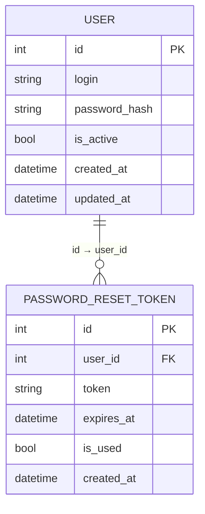

# S1 — Auth Service (Сервис аутентификации)

Сервис отвечает за регистрацию пользователей, вход (логин/пароль), выдачу JWT-токенов и сброс пароля.  
Данные профиля (ФИО, фото, контакты) хранятся в отдельном Profile Service.

---

## ER-диаграмма

**Список реляционных связей:**
- `USER.id → PASSWORD_RESET_TOKEN.user_id` — у одного пользователя может быть несколько токенов сброса пароля.

---

## Описание API

---

### Сущность: User (Пользователь)

---

#### 1. Зарегистрировать пользователя (Добавить)

**Метод:** `POST /users/`

**Информация для создания:**

| Параметр (англ.) | Пояснение               | Обязательность | Тип    | Ограничение    | Значение по умолчанию |
|------------------|-------------------------|----------------|--------|----------------|-----------------------|
| login            | Логин пользователя      | Обязательный   | string | 3–150 символов | —                     |
| password         | Пароль (открытый текст) | Обязательный   | string | 6–255 символов | —                     |

**Уникальные комбинации параметров:** `login` — уникален.

**Информация при успешном создании:**

| Параметр (англ.) | Тип      |
|------------------|----------|
| id               | int      |
| login            | string   |
| is_active        | bool     |
| created_at       | datetime |
| updated_at       | datetime |

---

#### 2. Изменить пользователя по ID

**Метод:** `PUT /users/{id}`

**Информация для изменения:**

| Параметр (англ.) | Пояснение    | Обязательность | Тип    | Ограничение    |
|------------------|--------------|----------------|--------|----------------|
| login            | Новый логин  | Необязательный | string | 3–150 символов |
| password         | Новый пароль | Необязательный | string | 6–255 символов |

**Информация при успешном изменении:**

| Параметр (англ.) | Тип      |
|------------------|----------|
| id               | int      |
| login            | string   |
| is_active        | bool     |
| created_at       | datetime |
| updated_at       | datetime |

---

#### 3. Удалить пользователя по ID

**Метод:** `DELETE /users/{id}`

Удаление **жёсткое** (запись физически удаляется из БД), так как Auth Service входит в список сервисов с жёстким удалением.

**Возвращаемое значение:**

| Параметр (англ.) | Тип  | Пояснение                             |
|------------------|------|---------------------------------------|
| success          | bool | `true` — удалён, `false` — не найден |

---

#### 4. Получить пользователя по ID

**Метод:** `GET /users/{id}`

**Возвращаемая информация:**

| Параметр (англ.) | Пояснение                 | Тип      |
|------------------|---------------------------|----------|
| id               | Уникальный идентификатор  | int      |
| login            | Логин                     | string   |
| is_active        | Активен ли аккаунт        | bool     |
| created_at       | Дата регистрации          | datetime |
| updated_at       | Дата последнего изменения | datetime |

---

#### 5. Получить список пользователей по заданным параметрам

**Метод:** `GET /users/`

**Параметры запроса:**

| Параметр (англ.) | Пояснение                    | Тип    |
|------------------|------------------------------|--------|
| login            | Фильтр по логину (частичный) | string |
| is_active        | Фильтр по активности         | bool   |

**Возвращаемый список:**

| Параметр (англ.) | Тип      |
|------------------|----------|
| id               | int      |
| login            | string   |
| is_active        | bool     |
| created_at       | datetime |
| updated_at       | datetime |

---

### Дополнительные эндпоинты (аутентификация)

#### Вход (логин)

**Метод:** `POST /auth/login`

**Параметры запроса:**

| Параметр (англ.) | Пояснение | Тип    |
|------------------|-----------|--------|
| login            | Логин     | string |
| password         | Пароль    | string |

**Возвращаемая информация при успехе:**

| Параметр (англ.) | Тип    |
|------------------|--------|
| access_token     | string |
| token_type       | string |

---

#### Сброс пароля — запрос токена

**Метод:** `POST /auth/reset-password/request`

**Параметры запроса:**

| Параметр (англ.) | Пояснение | Тип    |
|------------------|-----------|--------|
| login            | Логин     | string |

**Возвращаемая информация при успехе:**

| Параметр (англ.) | Тип      |
|------------------|----------|
| id               | int      |
| user_id          | int      |
| token            | string   |
| expires_at       | datetime |
| is_used          | bool     |
| created_at       | datetime |

---

#### Сброс пароля — применение

**Метод:** `POST /auth/reset-password/confirm`

**Параметры запроса:**

| Параметр (англ.) | Пояснение    | Тип    |
|------------------|--------------|--------|
| token            | Токен сброса | string |
| new_password     | Новый пароль | string |

**Возвращаемая информация при успехе:**

| Параметр (англ.) | Тип      |
|------------------|----------|
| id               | int      |
| login            | string   |
| is_active        | bool     |
| created_at       | datetime |
| updated_at       | datetime |

---

### Сущность: PasswordResetToken (Токен сброса пароля)

---

#### 1. Создать токен сброса пароля

**Метод:** `POST /reset-tokens/`

| Параметр (англ.) | Пояснение             | Обязательность | Тип      | Ограничение | Значение по умолчанию |
|------------------|-----------------------|----------------|----------|-------------|-----------------------|
| user_id          | ID пользователя       | Обязательный   | int      | > 0         | —                     |
| token            | Уникальный токен      | Обязательный   | string   | max 255     | —                     |
| expires_at       | Срок действия токена  | Обязательный   | datetime | —           | —                     |

**Информация при успешном создании:**

| Параметр (англ.) | Тип      |
|------------------|----------|
| id               | int      |
| user_id          | int      |
| token            | string   |
| expires_at       | datetime |
| is_used          | bool     |
| created_at       | datetime |

---

#### 2. Изменить токен по ID

**Метод:** `PUT /reset-tokens/{id}`

| Параметр (англ.) | Пояснение                       | Обязательность | Тип  | Ограничение |
|------------------|---------------------------------|----------------|------|-------------|
| is_used          | Отметить как использованный     | Необязательный | bool | —           |

**Информация при успешном изменении:**

| Параметр (англ.) | Тип      |
|------------------|----------|
| id               | int      |
| user_id          | int      |
| token            | string   |
| expires_at       | datetime |
| is_used          | bool     |
| created_at       | datetime |

---

#### 3. Удалить токен по ID

**Метод:** `DELETE /reset-tokens/{id}`

Удаление **жёсткое**.

| Параметр (англ.) | Тип  |
|------------------|------|
| success          | bool |

---

#### 4. Получить токен по ID

**Метод:** `GET /reset-tokens/{id}`

| Параметр (англ.) | Пояснение             | Тип      |
|------------------|-----------------------|----------|
| id               | Идентификатор         | int      |
| user_id          | ID пользователя       | int      |
| token            | Токен                 | string   |
| expires_at       | Срок действия         | datetime |
| is_used          | Использован ли        | bool     |
| created_at       | Дата создания         | datetime |

---

#### 5. Получить список токенов по параметрам

**Метод:** `GET /reset-tokens/`

| Параметр (англ.) | Пояснение                     | Тип  |
|------------------|-------------------------------|------|
| user_id          | Фильтр по ID пользователя     | int  |
| is_used          | Фильтр по использованности    | bool |

**Возвращаемый список:**

| Параметр (англ.) | Тип      |
|------------------|----------|
| id               | int      |
| user_id          | int      |
| token            | string   |
| expires_at       | datetime |
| is_used          | bool     |
| created_at       | datetime |