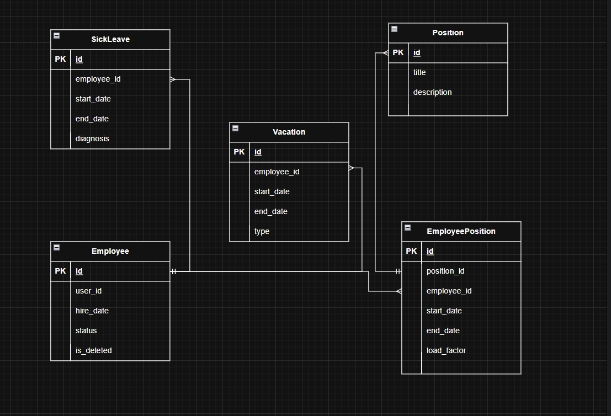

# Сервис статуса сотрудника (Employee Status Service) – Вариант 10

## Список функций
- `create_employee` – создание записи о сотруднике (только статусная информация)
- `update_employee` – изменение статусной информации сотрудника
- `delete_employee` – мягкое удаление (is_deleted = True)
- `get_employee` – получение сотрудника по ID
- `list_employees` – получение списка сотрудников с фильтрацией

> Примечание: ФИО, контакты и другие персональные данные хранятся в **Profile Service**. В данном сервисе используется `user_id` для связи с профилем.

---

## Сущность «Сотрудник»

### 1. Создание сотрудника

**Информация, требуемая для создания сотрудника**

| Параметр | Пояснение | Обязательность | Тип | Ограничение | Значение по умолчанию |
|----------|-----------|----------------|-----|-------------|-----------------------|
| `user_id` | ID сотрудника из Profile Service | Да | int | уникальный | – |
| `hire_date` | Дата найма | Да | date | не раньше 1900-01-01 | – |
| `status` | Текущий статус | Нет | string | active / on_vacation / sick_leave / fired | `'active'` |

**Уникальные комбинации:** `user_id` (глобально уникален)

**Информация, возвращаемая при успешном создании**

| Параметр | Тип |
|----------|-----|
| `id` | int |
| `user_id` | int |
| `hire_date` | date |
| `status` | string |

---

### 2. Изменение сотрудника по ID

**Информация, требуемая для изменения** (все поля опциональны)

| Параметр | Пояснение | Обязательность | Тип | Ограничение | Значение по умолчанию |
|----------|-----------|----------------|-----|-------------|-----------------------|
| `hire_date` | Дата найма | Нет | date | не раньше 1900-01-01 | – |
| `status` | Статус | Нет | string | active / on_vacation / sick_leave / fired | – |

**Информация, возвращаемая при успешном изменении**

| Параметр | Тип |
|----------|-----|
| `id` | int |
| `user_id` | int |
| `status` | string |
| `updated_at` | datetime |

---

### 3. Удаление сотрудника по ID

> Вернёт `True`, если сотрудник был помечен как удалённый (`is_deleted = True`), иначе `False`. Физического удаления из БД не происходит.

---

### 4. Получение сотрудника по ID

**Информация, возвращаемая при успешном поиске**

| Параметр | Пояснение | Тип |
|----------|-----------|-----|
| `id` | Внутренний ID записи | int |
| `user_id` | ID из Profile Service | int |
| `hire_date` | Дата найма | date |
| `status` | Текущий статус | string |
| `positions` | Список должностей с периодами и ставками | list |

---

### 5. Получение списка сотрудников по заданным параметрам

**Параметры для получения списка**

| Параметр | Пояснение | Тип | Описание |
|----------|-----------|-----|-----------|
| `user_id` | ID сотрудника | int | точное совпадение |
| `status` | Статус | string | exact match |
| `position_id` | Должность | int | через транзитивную таблицу |
| `hire_date_from` | Дата найма от | date | |
| `hire_date_to` | Дата найма до | date | |
| `limit` | Лимит | int | максимум записей (default 100) |
| `offset` | Смещение | int | для пагинации |

**Информация, возвращаемая в виде списка сотрудников** (каждый элемент)

| Параметр | Тип |
|----------|-----|
| `id` | int |
| `user_id` | int |
| `hire_date` | date |
| `status` | string |

---

## ER-диаграмма (3НФ, связь многие-ко-многим через EmployeePosition)

*Диаграмма включает таблицы: Employee, Position, EmployeePosition, Vacation, SickLeave. Все внешние ключи NOT NULL.*