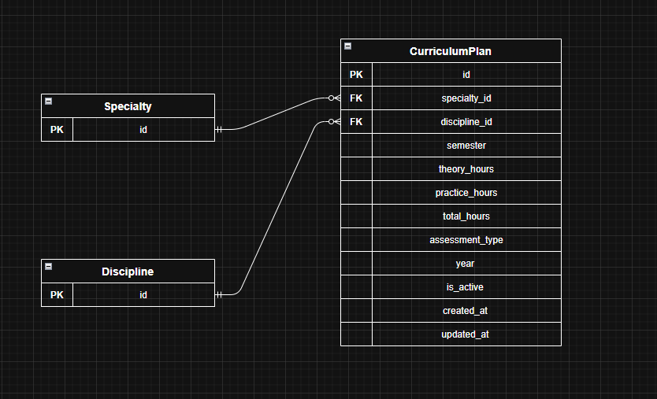

# S12 — Curriculum Plan Service (Сервис учебного плана)

Сервис управляет учебными планами: какие дисциплины изучаются в каком семестре, сколько часов теории и практики, форма отчётности. **Не хранит** сами дисциплины и специальности — они управляются Discipline Service и Specialty Service.

---

## Добавить запись учебного плана

Информация, требуемая для создания записи:

| Параметр | Пояснение | Обязательность | Тип | Ограничение | Значение по умолчанию |
|----------|-----------|----------------|-----|-------------|----------------------|
| specialty_id | ID специальности | Обязательно | integer | внешний ключ → Specialty Service | — |
| discipline_id | ID дисциплины | Обязательно | integer | внешний ключ → Discipline Service | — |
| semester | Номер семестра | Обязательно | integer | от 1 до 12 | — |
| theory_hours | Часов теории | Обязательно | integer | ≥ 0 | — |
| practice_hours | Часов практики | Обязательно | integer | ≥ 0 | — |
| assessment_type | Форма отчётности | Обязательно | string | 'exam', 'credit', 'graded_credit' | — |
| year | Учебный год | Обязательно | integer | ≥ 2000 | — |

**Уникальные комбинации параметров:**
- `(specialty_id, discipline_id, semester, year)` — одна дисциплина не может встречаться дважды в одном семестре одного учебного плана.

Информация, возвращаемая при успешном создании:

| Параметр | Тип |
|----------|-----|
| id | integer |
| specialty_id | integer |
| discipline_id | integer |
| semester | integer |
| theory_hours | integer |
| practice_hours | integer |
| total_hours | integer |
| assessment_type | string |
| year | integer |
| is_active | boolean |
| created_at | string |
| updated_at | string |

---

## Изменить запись учебного плана по ID

Информация, требуемая для изменения (все поля необязательны):

| Параметр | Пояснение | Обязательность | Тип | Ограничение |
|----------|-----------|----------------|-----|-------------|
| theory_hours | Новое кол-во часов теории | Опционально | integer | ≥ 0 |
| practice_hours | Новое кол-во часов практики | Опционально | integer | ≥ 0 |
| assessment_type | Новая форма отчётности | Опционально | string | 'exam', 'credit', 'graded_credit' |

> Поля `specialty_id`, `discipline_id`, `semester`, `year` изменить нельзя. При изменении `theory_hours` или `practice_hours` поле `total_hours` пересчитывается автоматически.

Информация, возвращаемая при успешном изменении:

| Параметр | Тип |
|----------|-----|
| id | integer |
| specialty_id | integer |
| discipline_id | integer |
| semester | integer |
| theory_hours | integer |
| practice_hours | integer |
| total_hours | integer |
| assessment_type | string |
| year | integer |
| is_active | boolean |
| created_at | string |
| updated_at | string |

---

## Удалить запись учебного плана по ID

Вернёт `true`, если запись была деактивирована (`is_active = false`), иначе `false`. Физически запись из БД не удаляется.

---

## Получить запись учебного плана по ID

| Параметр | Пояснение | Тип |
|----------|-----------|-----|
| id | Идентификатор | integer |
| specialty_id | ID специальности | integer |
| discipline_id | ID дисциплины | integer |
| semester | Номер семестра | integer |
| theory_hours | Часов теории | integer |
| practice_hours | Часов практики | integer |
| total_hours | Всего часов | integer |
| assessment_type | Форма отчётности | string |
| year | Учебный год | integer |
| is_active | Активна ли запись | boolean |
| created_at | Дата создания | string |
| updated_at | Дата последнего изменения | string |

---

## Получить список записей учебного плана по заданным параметрам

| Параметр | Пояснение | Тип | Ограничение |
|----------|-----------|-----|-------------|
| specialty_id | Фильтр по специальности | integer | |
| discipline_id | Фильтр по дисциплине | integer | |
| semester | Фильтр по семестру | integer | от 1 до 12 |
| year | Фильтр по учебному году | integer | ≥ 2000 |
| assessment_type | Фильтр по форме отчётности | string | 'exam', 'credit', 'graded_credit' |
| is_active | Фильтр по активности | boolean | |
| limit | Количество записей | integer | от 1 до 100 |
| offset | Смещение | integer | ≥ 0 |

Информация возвращается в виде списка записей, каждая содержит:

| Параметр | Тип |
|----------|-----|
| id | integer |
| specialty_id | integer |
| discipline_id | integer |
| semester | integer |
| theory_hours | integer |
| practice_hours | integer |
| total_hours | integer |
| assessment_type | string |
| year | integer |
| is_active | boolean |
| created_at | string |
| updated_at | string |

---

## ER-диаграмма

