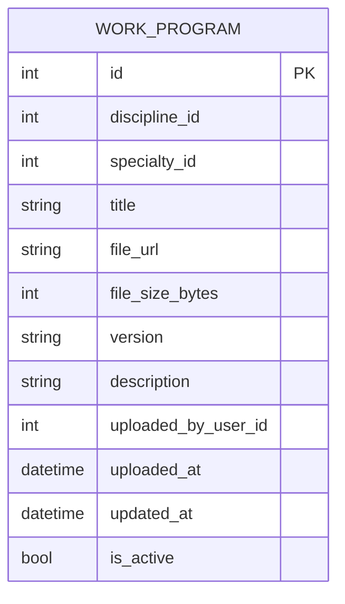

# S13 — Work Program Service (Сервис рабочих программ)

Сервис хранит файлы рабочих программ дисциплин с привязкой к дисциплине и специальности.  
Данные о самих дисциплинах и специальностях хранятся в соответствующих сервисах (Discipline Service, Specialty Service).

---

## ER-диаграмма

> `discipline_id` и `specialty_id` — внешние ключи к сервисам Discipline Service и Specialty Service соответственно; связи с другими сервисами на диаграмме не отображаются согласно требованиям.  
> `uploaded_by_user_id` — ссылка на пользователя в Auth Service.

---

## Описание API

### Сущность: WorkProgram (Рабочая программа)

---

### 1. Добавить рабочую программу

**Метод:** `POST /work-programs`

**Информация для создания:**

| Параметр (англ.)     | Пояснение                                      | Обязательность | Тип     | Ограничение                  | Значение по умолчанию |
|----------------------|------------------------------------------------|----------------|---------|------------------------------|-----------------------|
| discipline_id        | ID дисциплины (из Discipline Service)          | Обязательный   | int     | > 0                          | —                     |
| specialty_id         | ID специальности (из Specialty Service)        | Обязательный   | int     | > 0                          | —                     |
| title                | Название рабочей программы                     | Обязательный   | string  | max 255 символов             | —                     |
| file_url             | URL файла рабочей программы                    | Обязательный   | string  | max 512 символов             | —                     |
| file_size_bytes      | Размер файла в байтах                          | Необязательный | int     | > 0                          | null                  |
| version              | Версия программы                               | Необязательный | string  | max 50 символов              | "1.0"                 |
| description          | Описание / аннотация                           | Необязательный | string  | —                            | null                  |
| uploaded_by_user_id  | ID пользователя, загрузившего файл             | Обязательный   | int     | > 0                          | —                     |

**Уникальные комбинации параметров:**

- `(discipline_id, specialty_id, version)` — уникальная комбинация (нельзя загрузить дублирующую версию программы для той же дисциплины и специальности).

**Информация при успешном создании:**

| Параметр (англ.)    | Тип      |
|---------------------|----------|
| id                  | int      |
| discipline_id       | int      |
| specialty_id        | int      |
| title               | string   |
| file_url            | string   |
| file_size_bytes     | int      |
| version             | string   |
| description         | string   |
| uploaded_by_user_id | int      |
| uploaded_at         | datetime |
| updated_at          | datetime |
| is_active           | bool     |

---

### 2. Изменить рабочую программу по ID

**Метод:** `PUT /work-programs/{id}`

**Информация для изменения:**

| Параметр (англ.)    | Пояснение                          | Обязательность | Тип    | Ограничение      |
|---------------------|------------------------------------|----------------|--------|------------------|
| title               | Новое название                     | Необязательный | string | max 255 символов |
| file_url            | Новый URL файла                    | Необязательный | string | max 512 символов |
| file_size_bytes     | Новый размер файла в байтах        | Необязательный | int    | > 0              |
| version             | Новая версия программы             | Необязательный | string | max 50 символов  |
| description         | Новое описание                     | Необязательный | string | —                |

**Информация при успешном изменении:**

| Параметр (англ.)    | Тип      |
|---------------------|----------|
| id                  | int      |
| discipline_id       | int      |
| specialty_id        | int      |
| title               | string   |
| file_url            | string   |
| file_size_bytes     | int      |
| version             | string   |
| description         | string   |
| uploaded_by_user_id | int      |
| uploaded_at         | datetime |
| updated_at          | datetime |
| is_active           | bool     |

---

### 3. Удалить рабочую программу по ID

**Метод:** `DELETE /work-programs/{id}`

Удаление **логическое**: поле `is_active` устанавливается в `False`, запись физически не удаляется.

**Возвращаемое значение:**

| Параметр (англ.) | Тип  | Пояснение                                               |
|------------------|------|---------------------------------------------------------|
| result           | bool | `true` — запись найдена и помечена удалённой, иначе `false` |

---

### 4. Получить рабочую программу по ID

**Метод:** `GET /work-programs/{id}`

**Возвращаемая информация:**

| Параметр (англ.)    | Пояснение                                  | Тип      |
|---------------------|--------------------------------------------|----------|
| id                  | Уникальный идентификатор                   | int      |
| discipline_id       | ID дисциплины                              | int      |
| specialty_id        | ID специальности                           | int      |
| title               | Название рабочей программы                 | string   |
| file_url            | URL файла                                  | string   |
| file_size_bytes     | Размер файла в байтах                      | int      |
| version             | Версия программы                           | string   |
| description         | Описание / аннотация                       | string   |
| uploaded_by_user_id | ID пользователя, загрузившего файл         | int      |
| uploaded_at         | Дата и время загрузки                      | datetime |
| updated_at          | Дата и время последнего изменения          | datetime |
| is_active           | Активна ли запись                          | bool     |

---

### 5. Получить список рабочих программ по заданным параметрам

**Метод:** `GET /work-programs`

**Параметры запроса:**

| Параметр (англ.) | Пояснение                                       | Тип    |
|------------------|-------------------------------------------------|--------|
| discipline_id    | Фильтр по ID дисциплины                         | int    |
| specialty_id     | Фильтр по ID специальности                      | int    |
| version          | Фильтр по версии программы                      | string |
| uploaded_by_user_id | Фильтр по ID загрузившего пользователя       | int    |
| is_active        | Фильтр по активности (по умолчанию `true`)      | bool   |

**Возвращаемый список:**

| Параметр (англ.)    | Тип      |
|---------------------|----------|
| id                  | int      |
| discipline_id       | int      |
| specialty_id        | int      |
| title               | string   |
| file_url            | string   |
| file_size_bytes     | int      |
| version             | string   |
| description         | string   |
| uploaded_by_user_id | int      |
| uploaded_at         | datetime |
| updated_at          | datetime |
| is_active           | bool     |