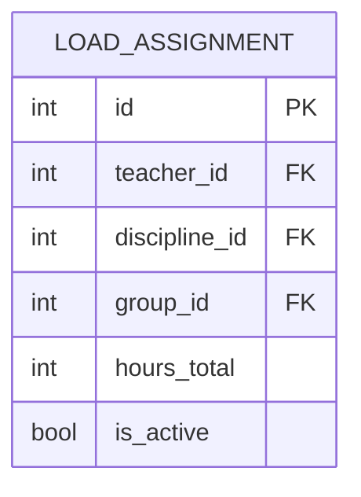

# Вариант 15 — Load Assignment Service

## ER-диаграмма

## Описание API 
Добавить Assignment

Информация требуемая для создания Assignment представлена в виде таблицы:

| Параметр | Пояснение | Обязательность | Тип | Ограничение | Значение по умолчанию |
|----------|-----------|----------------|-----|-------------|----------------------|
| teacher_id | ID преподавателя из Teacher Service | Да | int | > 0 | - |
| group_id | ID группы из Group Service | Да | int | > 0 | - |
| discipline_id | ID дисциплины из Discipline Service | Да | int | > 0 | - |
| hours_total | Количество часов нагрузки | Да | int | > 0 | - |

**Уникальные комбинации параметров:**  
`(teacher_id, discipline_id, group_id)`

Информация при успешном создании:

| Параметр | Тип |
|----------|-----|
| id | int |
| teacher_id | int |
| group_id | int |
| discipline_id | int |
| hours_total | int |
| is_active | bool |

---

## Изменить Assignment по ID

Информация требуемая для изменения Assignment по ID:

| Параметр | Пояснение | Обязательность | Тип | Ограничение |
|----------|-----------|----------------|-----|-------------|
| teacher_id | ID преподавателя | Нет | int | > 0 |
| group_id | ID группы | Нет | int | > 0 |
| discipline_id | ID дисциплины | Нет | int | > 0 |
| hours_total | Количество часов | Нет | int | > 0 |

Информация возвращаемая в случае удачного изменения Assignment:

| Параметр | Тип |
|----------|-----|
| id | int |
| teacher_id | int |
| group_id | int |
| discipline_id | int |
| hours_total | int |
| is_active | bool |

---

## Удалить Assignment по ID

Возвращаемое значение: true (если запись найдена и помечена удалённой), иначе false.

---

## Получить Assignment по ID

Информация возвращаемая в случае удачного поиска Assignment по ID:

| Параметр | Пояснение | Тип |
|----------|-----------|-----|
| id | Уникальный идентификатор назначения | int |
| teacher_id | ID преподавателя | int |
| group_id | ID группы | int |
| discipline_id | ID дисциплины | int |
| hours_total | Количество часов нагрузки | int |
| is_active | Активна ли запись | bool |

---

## Получить список Assignment по заданным параметрам

Информация требуемая для получения списка Assignment:

| Параметр | Пояснение | Тип |
|----------|-----------|-----|
| teacher_id | Фильтр по ID преподавателя | int (опционально) |
| group_id | Фильтр по ID группы | int (опционально) |
| discipline_id | Фильтр по ID дисциплины | int (опционально) |
| is_active | Фильтр по активности | bool (опционально) |
| limit | Максимальное количество записей | int (опционально) |
| offset | Количество пропускаемых записей | int (опционально) |

Информация возвращается в виде списка Assignment:

| Параметр | Тип |
|----------|-----|
| id | int |
| teacher_id | int |
| group_id | int |
| discipline_id | int |
| hours_total | int |
| is_active | bool |
