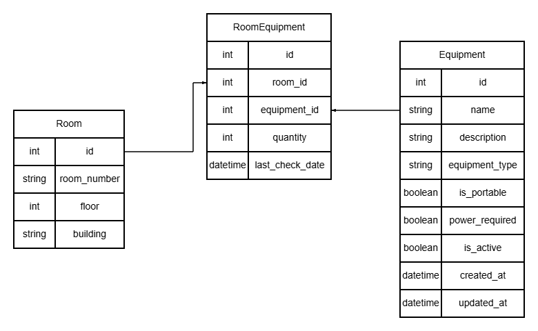

# Вариант 18. Room Equipment Service (Сервис оборудования аудиторий)
#  Сущность: Equipment
Оборудование, которым может быть оснащена аудитория (проектор, компьютеры, станки, доски и т.д.)                                                                                                      

# ***1. Добавить оборудование***

## 1.1 Требуемые параметры (создание)
| Параметр       | Пояснение                   | Обязательность | Тип     | Ограничение                | Значение по умолчанию |
| -------------- | --------------------------- | -------------- | ------- | -------------------------- | --------------------- |
| name           | Название оборудования       | Да             | string  | до 100 символов, уникально | нет                   |
| description    | Описание характеристик      | Нет            | string  | до 500 символов            | null                  |
| equipment_type | Тип                         | Да             | enum    | tech, furniture, tool      | tech                  |
| is_portable    | Переносное или стационарное | Да             | boolean | true/false                 | false                 |
| power_required | Требуется ли электропитание | Нет            | boolean | true/false                 | false                 |

Уникальная комбинация параметров:  
(name) — уникальное название оборудования.

## 1.2 Возвращаемые данные (успешное создание)
| Параметр       | Тип               |
| -------------- | ----------------- |
| id             | integer           |
| name           | string            |
| description    | string (или null) |
| equipment_type | enum              |
| is_portable    | boolean           |
| power_required | boolean           |
| created_at     | datetime          |
| is_active      | boolean           |
 
# ***2. Изменить оборудование по ID***

## 2.1 Требуемые параметры (изменение)
| Параметр       | Пояснение      | Обязательность | Тип     | Ограничение           |
| -------------- | -------------- | -------------- | ------- | --------------------- |
| name           | Новое название | Нет            | string  | 2..100, уникально     |
| description    | Новое описание | Нет            | string  | до 500 символов       |
| equipment_type | Новый тип      | Нет            | enum    | tech, furniture, tool |
| is_portable    | Переносное?    | Нет            | boolean | true/false            |
| power_required | Нужно питание? | Нет            | boolean | true/false            |

## 2.2 Возвращаемые данные (успешное изменение)
| Параметр       | Тип               |
| -------------- | ----------------- |
| id             | integer           |
| name           | string            |
| description    | string (или null) |
| equipment_type | enum              |
| is_portable    | boolean           |
| power_required | boolean           |
| updated_at     | datetime          |
| is_active      | boolean           |

# ***3. Удалить оборудование по ID (soft delete)***
Возвращаемое значение:
- true — оборудование помечено как удалённое (is_active = false)  
- false — оборудование не найдено или уже удалено

# ***4. Получить оборудование по ID***
Возвращаемые данные

| Параметр       | Пояснение            | Тип               |
| -------------- | -------------------- | ----------------- |
| id             | ИД оборудования      | integer           |
| name           | Название             | string            |
| description    | Описание             | string (или null) |
| equipment_type | Тип                  | enum              |
| is_portable    | Переносное           | boolean           |
| power_required | Требует питания      | boolean           |
| is_active      | Активно (не удалено) | boolean           |
| created_at     | Дата создания        | datetime          |
| updated_at     | Дата изменения       | datetime          |

# ***5. Получить список оборудования по заданным параметрам (фильтрация)***

## 5.1 Параметры запроса (query)
| Параметр       | Пояснение               | Тип     | 
| -------------- | ----------------------- | ------- |
| equipment_type | Фильтр по типу          | enum    | 
| is_portable    | Фильтр по переносимости | boolean | 
| power_required | Фильтр по питанию       | boolean |
| is_active      | Активное или удалённое  | boolean |
| search         | Поиск по названию       | string  |
| limit          | Лимит записей           | integer |
| offset         | Смещение                | integer |

## 5.2 Возвращаемые данные (список)
| Параметр       | Тип               |
| -------------- | ----------------- |
| id             | integer           |
| name           | string            |
| description    | string (или null) |
| equipment_type | enum              |
| is_portable    | boolean           |
| power_required | boolean           |
| is_active      | boolean           |

# ***ERD - диаграмма проекта S18 Сервис оборудования аудиторий (Room Equipment Service)***

