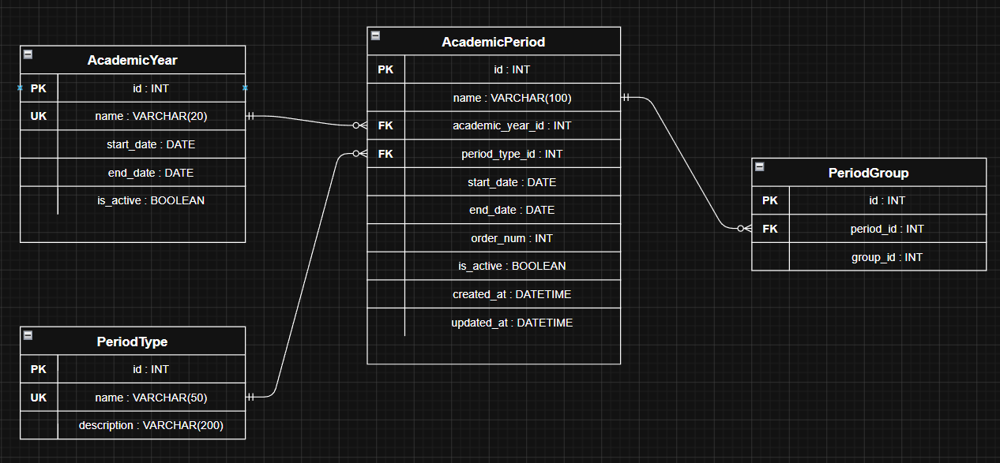

# Вариант 20 — Academic Period Service (Сервис учебных периодов)

Сервис управляет семестрами, модулями и другими учебными периодами. Хранит даты начала и окончания каждого периода, его тип и привязку к учебным группам. **Не хранит** сами группы — они управляются Group Service.

---

## Добавить учебный период

Информация, требуемая для создания учебного периода:

| Параметр         | Пояснение                       | Обязательность | Тип     | Ограничение                         | Значение по умолчанию |
|------------------|---------------------------------|----------------|---------|-------------------------------------|-----------------------|
| name             | Название периода                | Да             | string  | 1–100 символов                      | —                     |
| academic_year_id | ID учебного года                | Да             | integer | существующий id из AcademicYear     | —                     |
| period_type_id   | ID типа периода                 | Да             | integer | существующий id из PeriodType       | —                     |
| start_date       | Дата начала                     | Да             | string  | формат YYYY-MM-DD                   | —                     |
| end_date         | Дата окончания                  | Да             | string  | формат YYYY-MM-DD, позже start_date | —                     |
| order_num        | Порядковый номер в учебном году | Да             | integer | ≥ 1                                 | —                     |

**Уникальные комбинации параметров:**
- `(academic_year_id, period_type_id, order_num)` — в одном учебном году не может быть двух периодов одного типа с одинаковым порядковым номером.

Информация, возвращаемая при успешном создании:

| Параметр         | Тип     |
|------------------|---------|
| id               | integer |
| name             | string  |
| academic_year_id | integer |
| period_type_id   | integer |
| start_date       | string  |
| end_date         | string  |
| order_num        | integer |
| is_active        | boolean |
| created_at       | string  |
| updated_at       | string  |

---

## Изменить учебный период по ID

Информация, требуемая для изменения (все поля необязательны):

| Параметр         | Пояснение                   | Обязательность | Тип     | Ограничение                         |
|------------------|-----------------------------|----------------|---------|-------------------------------------|
| name             | Новое название              | Нет            | string  | 1–100 символов                      |
| academic_year_id | Новый учебный год           | Нет            | integer | существующий id                     |
| period_type_id   | Новый тип периода           | Нет            | integer | существующий id                     |
| start_date       | Новая дата начала           | Нет            | string  | формат YYYY-MM-DD                   |
| end_date         | Новая дата окончания        | Нет            | string  | формат YYYY-MM-DD, позже start_date |
| order_num        | Новый порядковый номер      | Нет            | integer | ≥ 1                                 |
| is_active        | Активность периода          | Нет            | boolean | true / false                        |

Информация, возвращаемая при успешном изменении:

| Параметр         | Тип     |
|------------------|---------|
| id               | integer |
| name             | string  |
| academic_year_id | integer |
| period_type_id   | integer |
| start_date       | string  |
| end_date         | string  |
| order_num        | integer |
| is_active        | boolean |
| created_at       | string  |
| updated_at       | string  |

---

## Удалить учебный период по ID

Вернёт `true`, если период был деактивирован (`is_active = false`), иначе `false`. Физически запись из БД не удаляется.

---

## Получить учебный период по ID

| Параметр         | Пояснение                 | Тип     |
|------------------|---------------------------|---------|
| id               | Идентификатор             | integer |
| name             | Название                  | string  |
| academic_year_id | ID учебного года          | integer |
| period_type_id   | ID типа периода           | integer |
| start_date       | Дата начала               | string  |
| end_date         | Дата окончания            | string  |
| order_num        | Порядковый номер          | integer |
| is_active        | Активен ли период         | boolean |
| created_at       | Дата создания             | string  |
| updated_at       | Дата последнего изменения | string  |

---

## Получить список учебных периодов по заданным параметрам

| Параметр         | Пояснение               | Тип     | Ограничение  |
|------------------|-------------------------|---------|--------------|
| academic_year_id | Фильтр по учебному году | integer |              |
| period_type_id   | Фильтр по типу периода  | integer |              |
| is_active        | Фильтр по активности    | boolean |              |
| limit            | Количество записей      | integer | от 1 до 100  |
| offset           | Смещение                | integer | ≥ 0          |

Информация возвращается в виде списка учебных периодов, каждый содержит:

| Параметр         | Тип     |
|------------------|---------|
| id               | integer |
| name             | string  |
| academic_year_id | integer |
| period_type_id   | integer |
| start_date       | string  |
| end_date         | string  |
| order_num        | integer |
| is_active        | boolean |
| created_at       | string  |
| updated_at       | string  |

---

## ER-диаграмма

