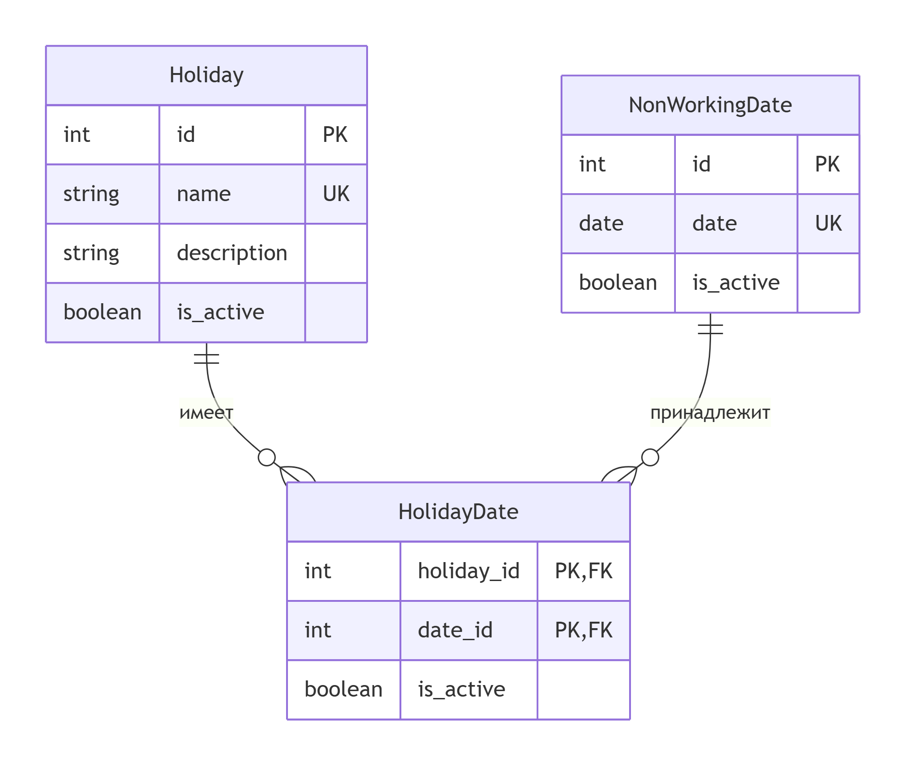

# Holiday Service (Сервис каникул и праздников) – Вариант 21

## Описание API

### 1. Праздники (Holidays)

#### Добавить праздник
| Параметр      | Пояснение          | Обязательность | Тип          | Ограничение          | Значение по умолчанию |
|---------------|--------------------|----------------|--------------|----------------------|------------------------|
| name          | Название праздника | да             | string(100)  | уникальное, не пустое | -                      |
| description   | Описание           | нет            | string       | -                    | "" (пустая строка)     |

**Возвращаемые параметры при успехе**
| Параметр      | Тип     |
|---------------|---------|
| id            | integer |
| name          | string  |
| description   | string  |
| is_active     | boolean |

#### Изменить праздник по ID
| Параметр      | Пояснение          | Обязательность | Тип          | Ограничение          |
|---------------|--------------------|----------------|--------------|----------------------|
| name          | Название праздника | нет            | string(100)  | уникальное, не пустое |
| description   | Описание           | нет            | string       | -                    |
| is_active     | Активен            | нет            | boolean      | -                    |

**Возвращаемые параметры:** такие же, как при добавлении.

#### Удалить праздник по ID
Возвращает `true`, если праздник был деактивирован, иначе `false`.

#### Получить праздник по ID
| Параметр      | Пояснение          | Тип     |
|---------------|--------------------|---------|
| id            | Идентификатор      | integer |
| name          | Название           | string  |
| description   | Описание           | string  |
| is_active     | Активен            | boolean |

#### Получить список праздников
**Параметры запроса:**
| Параметр      | Пояснение              | Тип                     |
|---------------|------------------------|-------------------------|
| is_active     | Фильтр по активности   | boolean (необязательный)|

**Возвращается:** список объектов праздника.

---

### 2. Нерабочие даты (NonWorkingDates)

#### Добавить дату
| Параметр | Пояснение | Обязательность | Тип  | Ограничение          | Значение по умолчанию |
|----------|-----------|----------------|------|----------------------|------------------------|
| date     | Дата      | да             | date | уникальная, YYYY-MM-DD | -                      |

**Возвращаемые параметры:**
| Параметр | Тип     |
|----------|---------|
| id       | integer |
| date     | string  |
| is_active| boolean |

#### Изменить дату по ID
| Параметр | Пояснение | Обязательность | Тип    | Ограничение          |
|----------|-----------|----------------|--------|----------------------|
| date     | Дата      | нет            | date   | уникальная           |
| is_active| Активна   | нет            | boolean| -                    |

**Возвращаемые параметры:** такие же, как при добавлении.

#### Удалить дату по ID
Возвращает `true`, если дата была деактивирована, иначе `false`.

#### Получить дату по ID
| Параметр | Пояснение     | Тип     |
|----------|---------------|---------|
| id       | Идентификатор | integer |
| date     | Дата          | string  |
| is_active| Активна       | boolean |

#### Получить список дат
**Параметры запроса:**
| Параметр | Пояснение            | Тип                     |
|----------|----------------------|-------------------------|
| is_active| Фильтр по активности | boolean (необязательный)|

**Возвращается:** список объектов дат.

---

### 3. Связи праздников и дат (HolidayDates)

#### Добавить связь
| Параметр   | Пояснение               | Обязательность | Тип     | Ограничение |
|------------|-------------------------|----------------|---------|-------------|
| holiday_id | ID праздника            | да             | integer | существует  |
| date_id    | ID нерабочей даты       | да             | integer | существует  |

**Уникальная комбинация:** (holiday_id, date_id)

**Возвращаемые параметры:**
| Параметр   | Тип     |
|------------|---------|
| holiday_id | integer |
| date_id    | integer |
| is_active  | boolean |

#### Изменить связь
| Параметр   | Пояснение | Обязательность | Тип    | Ограничение |
|------------|-----------|----------------|--------|-------------|
| is_active  | Активна   | нет            | boolean| -           |

**Возвращаемые параметры:** такие же, как при добавлении.

#### Удалить связь (деактивировать)
Возвращает `true`/`false`.

#### Получить связь по holiday_id и date_id
Возвращает объект связи.

#### Получить список связей
**Параметры запроса:**
| Параметр   | Пояснение               | Тип                     |
|------------|-------------------------|-------------------------|
| holiday_id | Фильтр по празднику     | integer (необязательный)|
| is_active  | Фильтр по активности    | boolean (необязательный)|

**Возвращается:** список объектов связей.

---

## ER-диаграмма

### Текстовое описание
- **Holiday** (id, name, description, is_active)
- **NonWorkingDate** (id, date, is_active)
- **HolidayDate** (holiday_id FK, date_id FK, is_active) – связующая таблица «многие ко многим»

Все поля NOT NULL. Связь многие ко многим реализована через транзитивную таблицу `HolidayDate`.