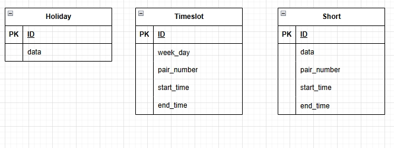

# Вариант №22. Timeslot Service (Сервис временных слотов)

## Сущность Timeslot (Временной слот)

### Добавить Timeslot

**Информация требуемая для создания Timeslot**

| Параметр | Пояснение | Обязательность | Тип | Ограничение | Значение по умолчанию |
| -------- | --------- | -------------- | --- | ----------- | --------------------- |
| week_day | День недели | Обязательно | integer | от 1 до 7 | - |
| pair_number | Номер пары | Обязательно | integer | от 1 до 7 | - |
| start_time | Время начала пары | Обязательно | time | формат HH:MM | - |
| end_time | Время окончания пары | Обязательно | time | формат HH:MM, больше start_time | - |

**Уникальные комбинации параметров:** pair_number и week_day

**Информация возвращаемая при успешном создании Timeslot**

| Параметр | Тип |
| -------- | --- |
| id | integer |
| week_day | integer |
| pair_number | integer |
| start_time | time |
| end_time | time |

### Изменить Timeslot по ID

**Информация требуемая для изменения Timeslot**

| Параметр | Пояснение | Обязательность | Тип | Ограничение | Значение по умолчанию |
| -------- | --------- | -------------- | --- | ----------- | --------------------- |
| week_day | День недели | Не обязательно | integer | от 1 до 7 | - |
| pair_number | Номер пары | Не обязательно | integer | от 1 до 7 | - |
| start_time | Время начала пары | Не обязательно | time | формат HH:MM | - |
| end_time | Время окончания пары | Не обязательно | time | формат HH:MM, больше start_time | - |

**Информация возвращаемая при успешном изменении Timeslot**

| Параметр | Тип |
| -------- | --- |
| id | integer |
| week_day | integer |
| pair_number | integer |
| start_time | time |
| end_time | time |

### Удалить Timeslot по ID

Вернет `True`, если временной слот был удален, иначе вернет `False`

### Получить Timeslot по ID

**Информация возвращаемая при успешном поиске Timeslot**

| Параметр | Пояснение | Тип |
| -------- | --------- | --- |
| id | Уникальный идентификатор временного слота | integer |
| week_day | День недели | integer |
| pair_number | Номер пары | integer |
| start_time | Время начала пары | time |
| end_time | Время окончания пары | time |

### Получить список Timeslot по заданным параметрам

**Информация требуемая для получения списка временных слотов**

| Параметр | Пояснение | Тип | Описание |
| -------- | --------- | --- | -------- |
| week_day | День недели | integer | Равно указанному числу |
| pair_number | Номер пары | integer | Равно указанному значению |
| start_time | Время начала пары | time | Равно указанному времени |
| end_time | Время окончания пары | time | Равно указанному времени |

**Информация возвращаемая в виде списка Timeslot**

| Параметр | Тип |
| -------- | --- |
| id | integer |
| week_day | integer |
| pair_number | integer |
| start_time | time |
| end_time | time |

---

## Сущность Holiday (Праздничные дни)

### Добавить Holiday

**Информация требуемая для создания Holiday**

| Параметр | Пояснение | Обязательность | Тип | Ограничение | Значение по умолчанию |
| -------- | --------- | -------------- | --- | ----------- | --------------------- |
| date | Дата праздника | Обязательно | date | формат DD.MM.YYYY, unique | - |

Уникальные комбинации параметров: date

**Информация возвращаемая при успешном создании Holiday**

| Параметр | Тип |
| -------- | --- |
| id | integer |
| date | date |

### Изменить Holiday по ID

**Информация требуемая для изменения Holiday**

| Параметр | Пояснение | Обязательность | Тип | Ограничение | Значение по умолчанию |
| -------- | --------- | -------------- | --- | ----------- | --------------------- |
| date | Дата праздника | Не обязательно | date | формат DD.MM.YYYY, unique | - |

**Информация возвращаемая при успешном изменении Holiday**

| Параметр | Тип |
| -------- | --- |
| id | integer |
| date | date |

### Удалить Holiday по ID

Вернет `True`, если праздничный день был удален, иначе вернет `False`

### Получить Holiday по ID

**Информация возвращаемая при успешном поиске Holiday**

| Параметр | Пояснение | Тип |
| -------- | --------- | --- |
| id | Уникальный идентификатор праздника | integer |
| date | Дата праздника | date |

### Получить список Holiday по заданным параметрам

**Информация требуемая для получения списка Holiday**

| Параметр | Пояснение | Тип | Описание |
| -------- | --------- | --- | -------- |
| date | Дата | date | Равно указанной дате |

**Информация возвращаемая в виде списка Holiday**

| Параметр | Тип |
| -------- | --- |
| id | integer |
| date | date |

---

## Сущность Short (Сокращенные дни)

### Добавить Short

**Информация требуемая для создания Short**

| Параметр | Пояснение | Обязательность | Тип | Ограничение | Значение по умолчанию |
| -------- | --------- | -------------- | --- | ----------- | --------------------- |
| date | Дата сокращенного дня | Обязательно | date | формат DD.MM.YYYY | - |
| pair_number | Номер пары | Обязательно | integer | от 1 до 7 | - |
| start_time | Время начала пары | Обязательно | time | формат HH:MM | - |
| end_time | Время окончания пары | Обязательно | time | формат HH:MM, больше start_time | - |

**Уникальные комбинации параметров:** pair_number и date

**Информация возвращаемая при успешном создании Short**

| Параметр | Тип |
| -------- | --- |
| id | integer |
| date | date |
| pair_number | integer |
| start_time | time |
| end_time | time |

### Изменить Short по ID

**Информация требуемая для изменения Short**

| Параметр | Пояснение | Обязательность | Тип | Ограничение | Значение по умолчанию |
| -------- | --------- | -------------- | --- | ----------- | --------------------- |
| date | Дата сокращенного дня | Не обязательно | date | формат DD.MM.YYYY | - |
| pair_number | Номер пары | Не обязательно | integer | от 1 до 7 | - |
| start_time | Время начала пары | Не обязательно | time | формат HH:MM | - |
| end_time | Время окончания пары | Не обязательно | time | формат HH:MM, больше start_time | - |

**Информация возвращаемая при успешном изменении Short**

| Параметр | Тип |
| -------- | --- |
| id | integer |
| date | date |
| pair_number | integer |
| start_time | time |
| end_time | time |

### Удалить Short по ID

Вернет `True`, если запись о сокращенном дне была удалена, иначе вернет `False`

### Получить Short по ID

**Информация возвращаемая при успешном поиске Short**

| Параметр | Пояснение | Тип |
| -------- | --------- | --- |
| id | Уникальный идентификатор записи | integer |
| date | Дата сокращенного дня | date |
| pair_number | Номер пары | integer |
| start_time | Время начала пары | time |
| end_time | Время окончания пары | time |

### Получить список Short по заданным параметрам

**Информация требуемая для получения списка Short**

| Параметр | Пояснение | Тип | Описание |
| -------- | --------- | --- | -------- |
| date | Дата | date | Равно указанной дате |

**Информация возвращаемая в виде списка Short**

| Параметр | Тип |
| -------- | --- |
| id | integer |
| date | date |
| pair_number | integer |
| start_time | time |
| end_time | time |

## ERD-диаграмма

