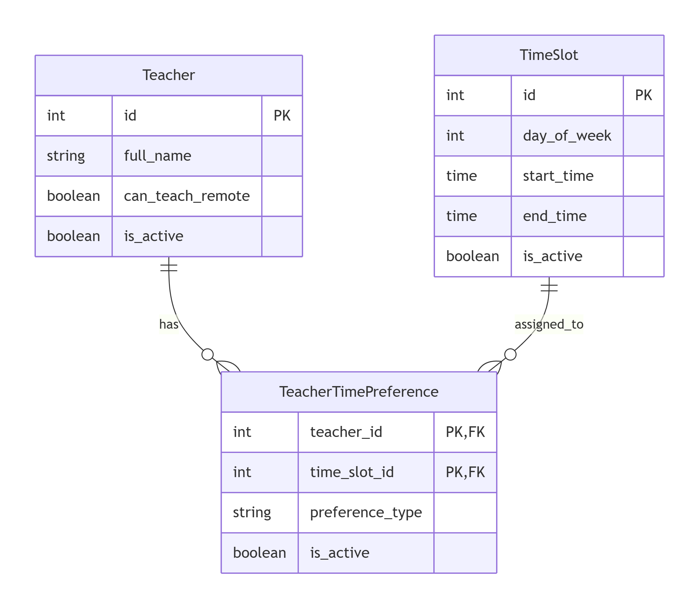

# Teacher Availability Service (Вариант 23)

## Описание API

### 1. Преподаватели (Teachers)

#### Добавить преподавателя
| Параметр | Пояснение | Обязательность | Тип | Ограничение | Значение по умолчанию |
|----------|-----------|----------------|-----|-------------|------------------------|
| full_name | ФИО преподавателя | да | string(100) | не пустая строка | - |
| can_teach_remote | Может вести дистанционно | нет | boolean | - | false |

**Возвращаемые параметры при успехе**
| Параметр | Тип |
|----------|-----|
| id | integer |
| full_name | string |
| can_teach_remote | boolean |
| is_active | boolean |

#### Изменить преподавателя по ID
| Параметр | Пояснение | Обязательность | Тип | Ограничение |
|----------|-----------|----------------|-----|-------------|
| full_name | ФИО | нет | string(100) | не пустая |
| can_teach_remote | Флаг дистанционки | нет | boolean | - |
| is_active | Активен | нет | boolean | - |

**Возвращаемые параметры:** такие же, как при добавлении.

#### Удалить преподавателя по ID
Возвращает `true`, если преподаватель был деактивирован, иначе `false`.

#### Получить преподавателя по ID
| Параметр | Пояснение | Тип |
|----------|-----------|-----|
| id | Идентификатор | integer |
| full_name | ФИО | string |
| can_teach_remote | Флаг | boolean |
| is_active | Активен | boolean |

#### Получить список преподавателей
**Параметры запроса:**
| Параметр | Пояснение | Тип |
|----------|-----------|-----|
| is_active | Фильтр по активности | boolean (необязательный) |

**Возвращается:** список объектов преподавателя.

---

### 2. Временные слоты (Time Slots)

#### Добавить слот
| Параметр | Пояснение | Обязательность | Тип | Ограничение |
|----------|-----------|----------------|-----|-------------|
| day_of_week | День недели (1-7) | да | integer | 1..7 |
| start_time | Начало | да | time | HH:MM |
| end_time | Конец | да | time | HH:MM |

**Уникальная комбинация:** day_of_week + start_time + end_time.

**Возвращаемые параметры:**
| Параметр | Тип |
|----------|-----|
| id | integer |
| day_of_week | integer |
| start_time | time |
| end_time | time |
| is_active | boolean |

#### Получить список слотов
Возвращает массив слотов без параметров.

---

### 3. Предпочтения преподавателей (Teacher Time Preferences)

#### Добавить предпочтение
| Параметр | Пояснение | Обязательность | Тип | Ограничение |
|----------|-----------|----------------|-----|-------------|
| teacher_id | ID преподавателя | да | integer | - |
| time_slot_id | ID слота | да | integer | - |
| preference_type | Тип предпочтения | да | string | 'methodical_day' / 'unavailable' |

**Уникальная комбинация:** (teacher_id, time_slot_id).

**Возвращаемые параметры:**
| Параметр | Тип |
|----------|-----|
| teacher_id | integer |
| time_slot_id | integer |
| preference_type | string |
| is_active | boolean |

#### Изменить предпочтение
| Параметр | Пояснение | Обязательность | Тип | Ограничение |
|----------|-----------|----------------|-----|-------------|
| preference_type | Тип | нет | string | 'methodical_day' / 'unavailable' |
| is_active | Активность | нет | boolean | - |

#### Удалить предпочтение
Возвращает `true`/`false`.

#### Получить предпочтение по teacher_id и time_slot_id
Возвращает объект предпочтения.

#### Получить список предпочтений
**Параметры запроса:**
| Параметр | Пояснение | Тип |
|----------|-----------|-----|
| teacher_id | Фильтр по преподавателю | integer (необязательный) |
| is_active | Фильтр по активности | boolean (необязательный) |

---

## ER-диаграмма

### Текстовое описание
- **Teacher** (id, full_name, can_teach_remote, is_active)
- **TimeSlot** (id, day_of_week, start_time, end_time, is_active)
- **TeacherTimePreference** (teacher_id FK, time_slot_id FK, preference_type, is_active) – связующая таблица между Teacher и TimeSlot.

Связь «многие ко многим»: преподаватель может иметь несколько временных слотов с предпочтениями, один и тот же слот может быть указан у разных преподавателей.
