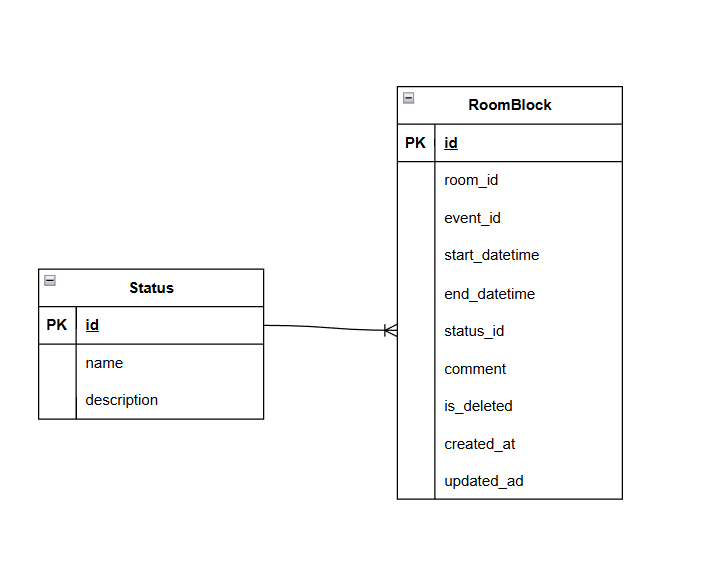

# Сервис 24: Room Availability Service (Сервис занятости аудиторий)

## Функционал сервиса
- Добавить RoomBlock
- Изменить RoomBlock по ID
- Удаление RoomBlock по ID
- Получить RoomBlock по ID
- Получить список RoomBlock по заданным параметрам

## Добавить RoomBlock
|Метод| Ссылка |
|---|---|
|`POST`|`/blocks/`|

Информация требуемая для создания RoomBlock представлена в виде таблицы со столбцами:

| Параметр | Пояснение | Обязательность | Тип | Ограничение | Значение по умолчанию |
|---|---|---|---|---|---|
| room_id | Идентификатор аудитории | Да | Integer | > 0 | - |
| event_id | Идентификатор события/причины блокировки | Да | Integer | > 0 | - |
| start_datetime | Дата и время начала блокировки | Да | DateTime | Не в прошлом | - |
| end_datetime | Дата и время окончания блокировки | Да | DateTime | > start_datetime | - |
| status_id | Идентификатор статуса (FK → Status) | Нет | Integer | > 0 | 1 (active) |
| comment | Дополнительный комментарий | Нет | String | Макс. 500 символов | "" |
| is_deleted | Флаг удаления (soft delete) | Нет | Boolean | True/False | False |

Перечислить уникальные комбинации параметров, если есть:

- Уникальная комбинация `(room_id, start_datetime, end_datetime)` не допускается (индекс в БД).
- Временные интервалы для одной аудитории не должны пересекаться (проверка в API, HTTP 409).
- Блокировки со статусом `cancelled` (status_id = 2) **не участвуют** в проверке пересечения интервалов (реализовано в `service.py`, константа `CANCELLED_STATUS_ID = 2` в `models.py`).

Коды ошибок:

| HTTP | Условие |
|---|---|
| 400 | Некорректные даты (в прошлом, end ≤ start) |
| 404 | room_id, event_id или status_id не найден |
| 409 | Пересечение интервалов или дубликат `(room_id, start_datetime, end_datetime)` |

Информация возвращаемая в случае удачного создания RoomBlock представлена в виде таблицы со столбцами:

| Параметр | Тип |
|---|---|
| id | Integer |
| room_id | Integer |
| event_id | Integer |
| start_datetime | DateTime |
| end_datetime | DateTime |
| status_id | Integer |
| comment | String |
| is_deleted | Boolean |
| created_at | DateTime |

## Изменить RoomBlock по ID
|Метод| Ссылка |
|---|---|
| `PATCH` | `/blocks/{block_id}` |

Информация требуемая для изменения RoomBlock по ID представлена в виде таблицы со столбцами:

| Параметр | Пояснение | Обязательность | Тип | Ограничение | Значение по умолчанию |
|---|---|---|---|---|---|
| block_id (в URL) | Идентификатор записи для изменения | Да | Integer | > 0 | - |
| start_datetime | Новая дата и время начала блокировки | Нет | DateTime | Не в прошлом | - |
| end_datetime | Новая дата и время окончания блокировки | Нет | DateTime | > start_datetime | - |
| status_id | Новый идентификатор статуса (FK → Status) | Нет | Integer | > 0 | - |
| comment | Новый комментарий | Нет | String | Макс. 500 символов | - |
| is_deleted | Флаг удаления (soft delete) | Нет | Boolean | True/False | - |

Информация возвращаемая в случае удачного изменения RoomBlock представлена в виде таблицы со столбцами:

| Параметр | Тип |
|---|---|
| id | Integer |
| room_id | Integer |
| event_id | Integer |
| start_datetime | DateTime |
| end_datetime | DateTime |
| status_id | Integer |
| comment | String |
| is_deleted | Boolean |
| created_at | DateTime |
| updated_at | DateTime |

## Удаление RoomBlock по ID
|Метод| Ссылка |
|---|---|
| `DELETE` | `/blocks/{block_id}` |

Вернет `true`, если RoomBlock была закрыта (удалена), иначе вернет `false`. Фактически запись из БД не удаляется, а реализуется через булевое поле `is_deleted`.

При повторном удалении или если запись не найдена — возвращается `false` (HTTP 200).

## Получить RoomBlock по ID
|Метод| Ссылка |
|---|---|
| `GET` | `/blocks/{block_id}` |

Информация возвращаемая в случае удачного поиска RoomBlock по ID представлена в виде таблицы со столбцами:

| Параметр | Пояснение | Тип |
|---|---|---|
| id | Идентификатор записи | Integer |
| room_id | Идентификатор аудитории | Integer |
| event_id | Идентификатор события/причины | Integer |
| start_datetime | Дата и время начала блокировки | DateTime |
| end_datetime | Дата и время окончания блокировки | DateTime |
| status_id | Идентификатор статуса | Integer |
| comment | Дополнительный комментарий | String |
| is_deleted | Флаг удаления (soft delete) | Boolean |
| created_at | Дата и время создания записи | DateTime |

## Получить список RoomBlock по заданным параметрам
|Метод| Ссылка |
|---|---|
| `GET` | `/blocks/` |

Информация требуемая для получения списка RoomBlock представлена в виде таблицы со столбцами:

| Параметр | Пояснение | Тип | Описание |
|---|---|---|---|
| room_id | Идентификатор аудитории | Integer | Фильтрация по ID аудитории |
| event_id | Идентификатор события/причины | Integer | Фильтрация по ID мероприятия |
| status_id | Идентификатор статуса | Integer | Фильтрация по ID статуса |
| date_from | Начало диапазона поиска | DateTime | Фильтрация по дате начала |
| date_to | Конец диапазона поиска | DateTime | Фильтрация по дате окончания |
| limit | Количество записей | Integer | Пагинация: максимум записей в ответе |
| offset | Смещение | Integer | Пагинация: количество пропускаемых записей |

Информация возвращается в виде списка RoomBlock и представлена в виде таблицы со столбцами:

| Параметр | Тип |
|---|---|
| id | Integer |
| room_id | Integer |
| event_id | Integer |
| start_datetime | DateTime |
| end_datetime | DateTime |
| status_id | Integer |
| comment | String |
| is_deleted | Boolean |
| created_at | DateTime |

## Вспомогательные эндпоинты

Используются для подготовки тестовых данных (создание аудиторий и событий перед блокировкой). Не являются основным CRUD RoomBlock, но реализованы в `service.py`.

### Добавить Room

| Метод | Ссылка |
|---|---|
| `POST` | `/rooms/` |

| Параметр | Пояснение | Обязательность | Тип | Ограничение |
|---|---|---|---|---|
| number | Номер аудитории | Да | String | Макс. 10 символов, уникальный |
| floor | Этаж | Да | Integer | ≥ 0 |
| capacity | Вместимость | Да | Integer | > 0 |

Ответ: `{ id, number, floor, capacity }`

### Получить список Room

| Метод | Ссылка |
|---|---|
| `GET` | `/rooms/` |

### Добавить Event

| Метод | Ссылка |
|---|---|
| `POST` | `/events/` |

| Параметр | Пояснение | Обязательность | Тип | Ограничение |
|---|---|---|---|---|
| title | Название события/причины | Да | String | Макс. 100 символов |
| type | Тип события | Да | String | Макс. 50 символов |

Ответ: `{ id, title, type }`

### Получить список Event

| Метод | Ссылка |
|---|---|
| `GET` | `/events/` |

### Справочник Status (инициализация БД)

При первом запуске в БД создаются записи:

| id | name | description |
|---|---|---|
| 1 | active | Активная блокировка |
| 2 | cancelled | Отменённая блокировка |
| 3 | pending | Ожидает подтверждения |

## ER-диаграмма

