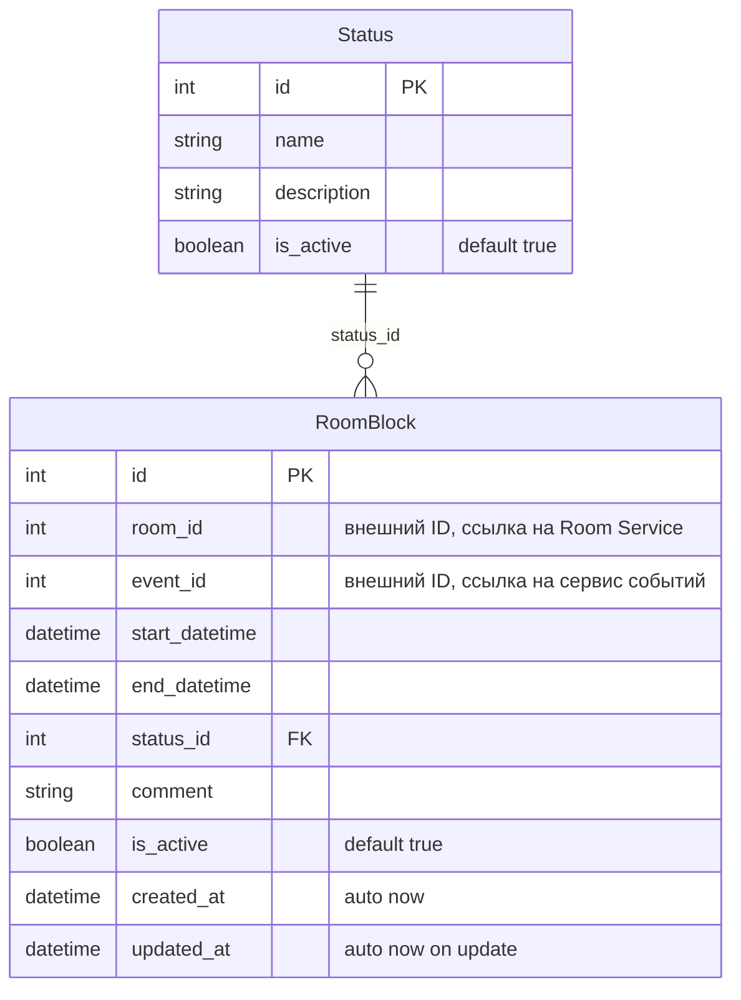

# Сервис 24: Room Availability Service (Сервис занятости аудиторий)

Сервис хранит только данные своей предметной области: блокировки аудиторий (`RoomBlock`) и локальный справочник статусов (`Status`).  
Данные аудиторий и событий из других сервисов не дублируются: используются только внешние идентификаторы `room_id` и `event_id` как числа.

## ER-диаграмма (Mermaid)

Примечания:
- `room_id` и `event_id` – внешние идентификаторы (на уровне бизнес-логики), ссылаются на данные в других микросервисах.
- `status_id` – внешний ключ к таблице `Status`.
- Поля `is_active` по умолчанию `true` (активная запись). Мягкое удаление устанавливает `is_active = false`.
- `created_at` и `updated_at` заполняются автоматически.

## Функционал сервиса
- **RoomBlock**: CRUD + список с фильтрацией (включая удалённые записи)
- **Status**: полный CRUD + список

## RoomBlock

### Добавить RoomBlock
| Метод | Ссылка |
|-------|--------|
| `POST` | `/blocks/` |

**Успешный ответ:** `201 Created`

| Параметр | Пояснение | Обязательность | Тип | Ограничение | Значение по умолчанию |
|----------|-----------|----------------|-----|-------------|----------------------|
| `room_id` | ID аудитории | Да | Integer | > 0 | - |
| `event_id` | ID события | Да | Integer | > 0 | - |
| `start_datetime` | Начало блокировки | Да | DateTime | Не в прошлом | - |
| `end_datetime` | Конец блокировки | Да | DateTime | > `start_datetime` | - |
| `status_id` | ID статуса | Нет | Integer | > 0 | `1` |
| `comment` | Комментарий | Нет | String | ≤ 500 | `""` |

**Уникальные комбинации:** `(room_id, start_datetime, end_datetime)` для активных записей (проверяется в бизнес-логике).

**Правила пересечений:** интервалы одной аудитории не должны пересекаться; блоки со статусом `cancelled` (`status_id = 2`) не участвуют в проверке.

**Возвращаемые данные:**

| Параметр | Тип |
|----------|-----|
| `id` | Integer |
| `room_id` | Integer |
| `event_id` | Integer |
| `start_datetime` | DateTime |
| `end_datetime` | DateTime |
| `status_id` | Integer |
| `comment` | String |
| `is_active` | Boolean |
| `created_at` | DateTime |
| `updated_at` | DateTime |

### Изменить RoomBlock по ID
| Метод | Ссылка |
|-------|--------|
| `PATCH` | `/blocks/{block_id}` |

**Параметры пути:**

| Параметр | Обязательность | Тип | Ограничение |
|----------|----------------|-----|-------------|
| `block_id` | Да | Integer | > 0 |

**Параметры запроса (тело JSON, все необязательные):**

| Параметр | Ограничение |
|----------|-------------|
| `start_datetime` | Не в прошлом |
| `end_datetime` | > `start_datetime` |
| `status_id` | > 0 |
| `comment` | ≤ 500 |

**Возвращаемые данные** – те же, что при создании.

### Удалить RoomBlock по ID (soft delete)
| Метод | Ссылка |
|-------|--------|
| `DELETE` | `/blocks/{block_id}` |

**Параметры пути:** `block_id` (>0)

**Успешный ответ:** `200 OK`

**Возвращаемое значение:** `{"success": true}` – если запись была помечена удалённой (`is_active = false`); `false` – если не найдена или уже удалена.

### Получить RoomBlock по ID
| Метод | Ссылка |
|-------|--------|
| `GET` | `/blocks/{block_id}` |

**Возвращаемые данные** – те же, что при создании (включая удалённые записи). При отсутствии записи – `404`.

### Получить список RoomBlock по параметрам
| Метод | Ссылка |
|-------|--------|
| `GET` | `/blocks/` |

**Параметры запроса (query):**

| Параметр | Тип | Примечание |
|----------|-----|------------|
| `room_id` | Integer | фильтр |
| `event_id` | Integer | фильтр |
| `status_id` | Integer | фильтр |
| `date_from` | DateTime | `end_datetime > date_from` |
| `date_to` | DateTime | `start_datetime < date_to` |
| `limit` | Integer | 1..100, по умолчанию 50 |
| `offset` | Integer | ≥0, по умолчанию 0 |

Если заданы оба `date_from` и `date_to`, возвращаются блокировки, пересекающие интервал `[date_from, date_to)`.  
**Возвращается список** (включая удалённые записи).

## Status

### Добавить статус
| Метод | Ссылка |
|-------|--------|
| `POST` | `/statuses/` |

**Успешный ответ:** `201 Created`

| Параметр | Пояснение | Обязательность | Тип | Ограничение | Значение по умолчанию |
|----------|-----------|----------------|-----|-------------|----------------------|
| `name` | Название статуса | Да | String | 1–20 символов, уникальное | - |
| `description` | Описание | Нет | String | ≤ 100 символов | `""` |

**Возвращаемые данные:**

| Параметр | Тип |
|----------|-----|
| `id` | Integer |
| `name` | String |
| `description` | String |
| `is_active` | Boolean |

### Изменить статус по ID
| Метод | Ссылка |
|-------|--------|
| `PATCH` | `/statuses/{status_id}` |

**Параметры пути:** `status_id` (>0)

**Параметры запроса (тело, необязательные):**

| Параметр | Ограничение |
|----------|-------------|
| `name` | 1–20 символов, уникальное |
| `description` | ≤ 100 символов |

**Возвращаемые данные** – те же, что при создании.

### Удалить статус по ID (soft delete)
| Метод | Ссылка |
|-------|--------|
| `DELETE` | `/statuses/{status_id}` |

**Параметры пути:** `status_id` (>0)

**Успешный ответ:** `200 OK`

**Возвращаемое значение:** `{"success": true}` – если запись была помечена удалённой (`is_active = false`); `false` – если не найдена или уже удалена.  
Если статус используется в активных блокировках (`RoomBlock` с `is_active = true`), возвращается `409 Conflict`.

### Получить статус по ID
| Метод | Ссылка |
|-------|--------|
| `GET` | `/statuses/{status_id}` |

**Возвращаемые данные** – объект с полями `id`, `name`, `description`, `is_active`. При отсутствии – `404`.

### Получить список статусов
| Метод | Ссылка |
|-------|--------|
| `GET` | `/statuses/` |

**Возвращается список** объектов (все, включая удалённые).

## Коды ошибок

| HTTP | Условие |
|------|---------|
| `400` | Некорректные даты, невалидные поля |
| `404` | Объект не найден |
| `409` | Конфликт данных (дубликат, пересечение, статус используется) |

## Справочник предопределённых статусов (инициализация)

| id | name | description |
|----|------|-------------|
| 1 | active | Active block |
| 2 | cancelled | Cancelled block |
| 3 | pending | Pending confirmation |

## Точки входа REST API

| Метод | Эндпоинт | Описание |
|-------|----------|----------|
| `POST` | `/blocks/` | Создать блокировку |
| `PATCH` | `/blocks/{block_id}` | Обновить блокировку |
| `DELETE` | `/blocks/{block_id}` | Удалить блокировку (soft) |
| `GET` | `/blocks/{block_id}` | Получить блокировку |
| `GET` | `/blocks/` | Список блокировок |
| `POST` | `/statuses/` | Создать статус |
| `PATCH` | `/statuses/{status_id}` | Обновить статус |
| `DELETE` | `/statuses/{status_id}` | Удалить статус (soft) |
| `GET` | `/statuses/{status_id}` | Получить статус |
| `GET` | `/statuses/` | Список статусов |
| `GET` | `/health` | Проверка здоровья |
