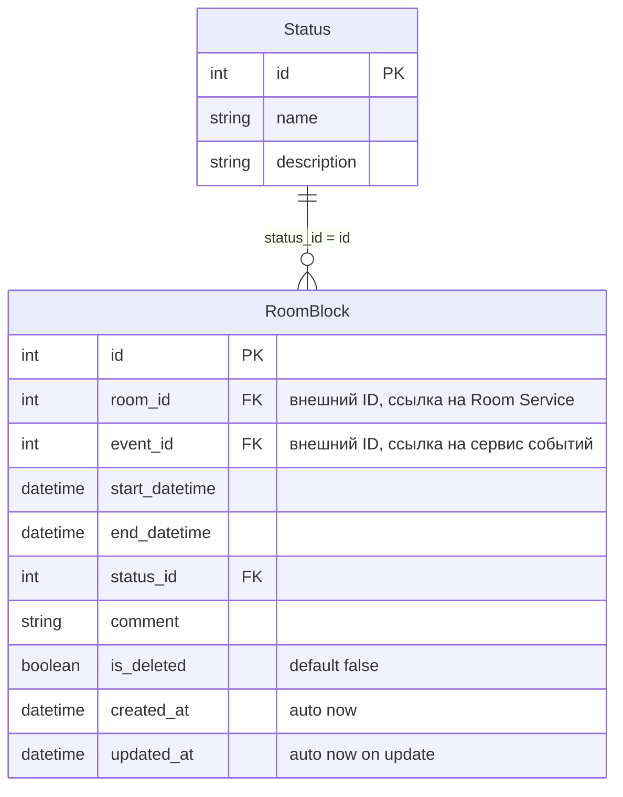

# Сервис 24: Room Availability Service (Сервис занятости аудиторий)

Сервис хранит только данные своей предметной области: блокировки аудиторий (`RoomBlock`) и локальный справочник статусов (`Status`).  
Данные аудиторий и событий из других сервисов не дублируются: используются только внешние идентификаторы `room_id` и `event_id` как числа.

## ER-диаграмма (Mermaid)



Примечания:
- `room_id` и `event_id` – внешние идентификаторы (FK на уровне бизнес-логики), ссылаются на данные в других микросервисах (Room Service и сервис событий).
- `status_id` – внешний ключ к таблице `Status` (связь `RoomBlock.status_id` → `Status.id`).
- `is_deleted` по умолчанию `false`, `created_at` и `updated_at` заполняются автоматически.

## Функционал сервиса
- Добавить `RoomBlock`
- Изменить `RoomBlock` по ID
- Удалить `RoomBlock` по ID (soft delete)
- Получить `RoomBlock` по ID
- Получить список `RoomBlock` по параметрам

## Добавить RoomBlock
| Метод | Ссылка |
|---|---|
| `POST` | `/blocks/` |

**Успешный ответ:** `201 Created`

| Параметр | Пояснение | Обязательность | Тип | Ограничение | Значение по умолчанию |
|---|---|---|---|---|---|
| `room_id` | ID аудитории (внешний ID из Room Service) | Да | Integer | > 0 | - |
| `event_id` | ID события/причины (внешний ID) | Да | Integer | > 0 | - |
| `start_datetime` | Дата и время начала блокировки | Да | DateTime | Не в прошлом | - |
| `end_datetime` | Дата и время окончания блокировки | Да | DateTime | > `start_datetime` | - |
| `status_id` | ID статуса (`Status`) | Нет | Integer | > 0 | `1` |
| `comment` | Комментарий | Нет | String | длина <= 500 | `""` |

Уникальные комбинации:
- `(room_id, start_datetime, end_datetime)` уникальна (проверяется на уровне бизнес-логики с учётом `is_deleted = false`).

Правила пересечений:
- интервалы одной аудитории не должны пересекаться;
- блоки со статусом `cancelled` (`status_id = 2`) в проверке пересечений не участвуют.

**Возвращаемые данные**:

| Параметр | Тип |
|---|---|
| `id` | Integer |
| `room_id` | Integer |
| `event_id` | Integer |
| `start_datetime` | DateTime |
| `end_datetime` | DateTime |
| `status_id` | Integer |
| `comment` | String |
| `is_deleted` | Boolean |
| `created_at` | DateTime |
| `updated_at` | DateTime |

## Изменить RoomBlock по ID
| Метод | Ссылка |
|---|---|
| `PATCH` | `/blocks/{block_id}` |

**Параметры пути (URL)**:

| Параметр | Пояснение | Обязательность | Тип | Ограничение |
|---|---|---|---|---|
| `block_id` | Идентификатор записи для изменения | Да | Integer | > 0 |

**Параметры запроса** (в теле JSON, все необязательные):

| Параметр | Пояснение | Обязательность | Тип | Ограничение |
|---|---|---|---|---|
| `start_datetime` | Новое начало блокировки | Нет | DateTime | Не в прошлом |
| `end_datetime` | Новое окончание блокировки | Нет | DateTime | > `start_datetime` |
| `status_id` | Новый статус | Нет | Integer | > 0 |
| `comment` | Новый комментарий | Нет | String | длина <= 500 |

**Возвращаемые данные** (те же поля, что и при создании).

## Удалить RoomBlock по ID (soft delete)
| Метод | Ссылка |
|---|---|
| `DELETE` | `/blocks/{block_id}` |

**Параметры пути**:

| Параметр | Пояснение | Обязательность | Тип | Ограничение |
|---|---|---|---|---|
| `block_id` | Идентификатор записи для удаления | Да | Integer | > 0 |

**Успешный ответ:** `200 OK`

**Возвращаемое значение**:
```json
{"success": true}
```
- `true`, если запись была помечена удалённой (`is_deleted = true`);
- `false`, если запись не найдена или уже удалена.

Запись физически не удаляется, используется поле `is_deleted`.

## Получить RoomBlock по ID
| Метод | Ссылка |
|---|---|
| `GET` | `/blocks/{block_id}` |

**Параметры пути**:

| Параметр | Пояснение | Обязательность | Тип | Ограничение |
|---|---|---|---|---|
| `block_id` | Идентификатор записи | Да | Integer | > 0 |

**Успешный ответ:** `200 OK`

**Возвращаемые данные** (те же поля, что при создании).  
Запись возвращается независимо от значения `is_deleted` (включая удалённые). Клиент может видеть флаг `is_deleted`.

## Получить список RoomBlock по заданным параметрам
| Метод | Ссылка |
|---|---|
| `GET` | `/blocks/` |

**Успешный ответ:** `200 OK`

**Параметры запроса** (query):

| Параметр | Пояснение | Обязательность | Тип | Формат / Примечание |
|---|---|---|---|---|
| `room_id` | Фильтр по аудитории | Нет | Integer | - |
| `event_id` | Фильтр по событию | Нет | Integer | - |
| `status_id` | Фильтр по статусу | Нет | Integer | - |
| `date_from` | Левая граница периода | Нет | DateTime | ISO 8601, например `2025-01-01T00:00:00`. Ищутся блокировки, у которых `end_datetime > date_from` (строгое неравенство) |
| `date_to` | Правая граница периода | Нет | DateTime | ISO 8601. Ищутся блокировки, у которых `start_datetime < date_to` (строгое неравенство) |
| `limit` | Лимит | Нет | Integer | 1..100, по умолчанию 50 |
| `offset` | Смещение | Нет | Integer | ≥0, по умолчанию 0 |

Если заданы оба параметра `date_from` и `date_to`, возвращаются блокировки, пересекающиеся с интервалом `[date_from, date_to)` (полуоткрытый интервал: начало включительно, конец исключительно).

**Возвращаемый список** – массив объектов с теми же полями, что и при создании (включая записи с `is_deleted = true`). Для фильтрации удалённых записей клиент может использовать дополнительный параметр (например, `is_deleted=false`), если он будет добавлен в API.

## Коды ошибок
| HTTP | Условие |
|---|---|
| `400` | Некорректные даты (`start_datetime` в прошлом, `end_datetime <= start_datetime`) |
| `404` | Не найден `block_id` / не найден `status_id` |
| `409` | Пересечение интервалов или дубликат `(room_id, start_datetime, end_datetime)` |

## Справочник Status (инициализация БД)
| id | name | description |
|---|---|---|
| 1 | active | Active block |
| 2 | cancelled | Cancelled block |
| 3 | pending | Pending confirmation |

## Точки входа REST API
| Метод | Эндпоинт | Описание |
|---|---|---|
| `POST` | `/blocks/` | Создать блокировку |
| `PATCH` | `/blocks/{block_id}` | Обновить блокировку |
| `DELETE` | `/blocks/{block_id}` | Удалить блокировку (soft delete) |
| `GET` | `/blocks/{block_id}` | Получить блокировку по ID (включая удалённые) |
| `GET` | `/blocks/` | Получить список блокировок |
| `GET` | `/health` | Проверка доступности сервиса |
