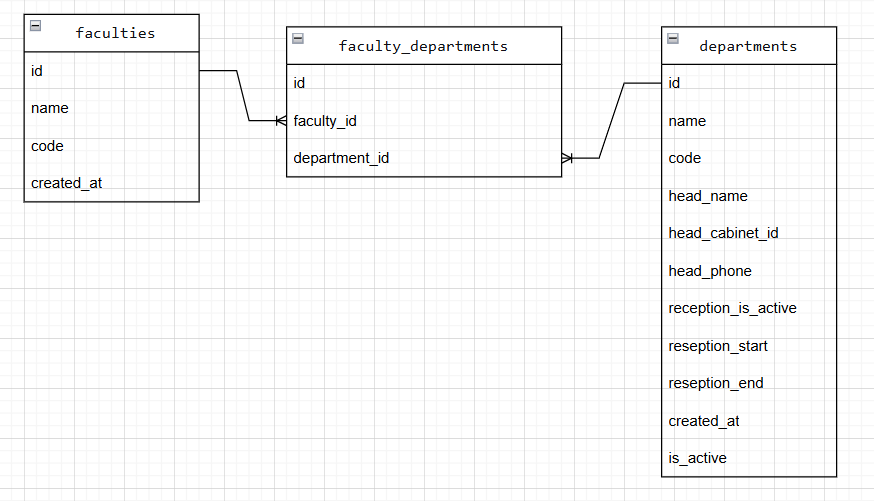

# S5 Faculty Service - Справочник отделений СПО

## Сущность: Department (Отделение среднего профессионального образования)

### 1. Информация для создания сущности

| Параметр | Пояснение | Обязательность | Тип | Ограничение | Значение по умолчанию |
|----------|-----------|----------------|-----|-------------|----------------------|
| name | Полное наименование отделения СПО | Да | string | 2-200 символов | — |
| code | Шифр направления подготовки (например, 09.02.07) | Да | string | 2-20 символов | — |
| head_name | ФИО заведующего отделением | Да | string | 2-150 символов | — |
| head_cabinet_id | Номер кабинета заведующего | Да | string | ровно 3 цифры (например, 101) | — |
| head_phone | Контактный телефон заведующего | Нет | string | 2-20 символов | null |
| reception_is_active | Приёмные часы активны? | Нет | boolean (true/false) | true/false | false |
| reception_start | Час начала приёма | Нет | integer | 0-23 | null |
| reception_end | Час окончания приёма | Нет | integer | 0-23 (должен быть ≥ reception_start) | null |

**Уникальные комбинации параметров:** (name, code)

### 2. Информация, возвращаемая при успешном создании

| Параметр | Тип |
|----------|-----|
| id | integer |
| name | string |
| code | string |
| head_name | string |
| head_cabinet_id | string |
| head_phone | string \| null |
| reception_is_active | boolean |
| reception_start | integer \| null |
| reception_end | integer \| null |
| created_at | datetime |
| is_active | boolean |

## Изменить сущность по ID

**Параметр пути (URL):** `id` (integer) – уникальный идентификатор отделения

### 3. Информация для изменения сущности (тело запроса)

| Параметр | Пояснение | Обязательность | Тип | Ограничение |
|----------|-----------|----------------|-----|-------------|
| name | Название отделения | Нет | string | 2-200 символов |
| code | Шифр направления подготовки | Нет | string | 2-20 символов |
| head_name | ФИО заведующего | Нет | string | 2-150 символов |
| head_cabinet_id | Номер кабинета | Нет | string | ровно 3 цифры |
| head_phone | Телефон заведующего | Нет | string | 2-20 символов |
| reception_is_active | Приём активен | Нет | boolean | true/false |
| reception_start | Час начала приёма | Нет | integer | 0-23 |
| reception_end | Час окончания приёма | Нет | integer | 0-23 (≥ reception_start) |

### 4. Информация, возвращаемая при успешном изменении

| Параметр | Тип |
|----------|-----|
| id | integer |
| name | string |
| code | string |
| head_name | string |
| head_cabinet_id | string |
| head_phone | string \| null |
| reception_is_active | boolean |
| reception_start | integer \| null |
| reception_end | integer \| null |
| created_at | datetime |
| is_active | boolean |

## Удалить сущность по ID

**Параметр пути (URL):** `id` (integer) – уникальный идентификатор отделения

**Возвращаемое значение:** `True` – отделение помечено как удалённое (мягкое удаление), `False` – отделение не найдено.

## Получить сущность по ID

**Параметр пути (URL):** `id` (integer) – уникальный идентификатор отделения

### 5. Информация, возвращаемая при успешном поиске

| Параметр | Пояснение | Тип |
|----------|-----------|-----|
| id | Уникальный номер отделения | integer |
| name | Название отделения | string |
| code | Шифр направления подготовки | string |
| head_name | ФИО заведующего отделением | string |
| head_cabinet_id | Номер кабинета заведующего | string |
| head_phone | Телефон заведующего | string \| null |
| reception_is_active | Активен ли приём | boolean |
| reception_start | Час начала приёма | integer \| null |
| reception_end | Час окончания приёма | integer \| null |
| created_at | Дата и время создания записи | datetime |
| is_active | Активна ли запись (не удалена) | boolean |

## Получить список сущностей по заданным параметрам

### 6. Параметры для получения списка (query parameters)

| Параметр | Пояснение | Обязательность | Тип | Ограничение | Значение по умолчанию |
|----------|-----------|----------------|-----|-------------|----------------------|
| page | Номер страницы (пагинация) | Нет | integer | ≥ 1 | 1 |
| size | Количество записей на странице | Нет | integer | 1-100 | 10 |
| name | Поиск по части названия отделения | Нет | string | любая строка (частичное совпадение) | — |

### 7. Информация, возвращаемая в виде списка сущностей

| Параметр | Тип |
|----------|-----|
| id | integer |
| name | string |
| code | string |
| head_name | string |
| head_cabinet_id | string |
| head_phone | string \| null |
| reception_is_active | boolean |
| reception_start | integer \| null |
| reception_end | integer \| null |
| created_at | datetime |
| is_active | boolean |

## ER-диаграмма

