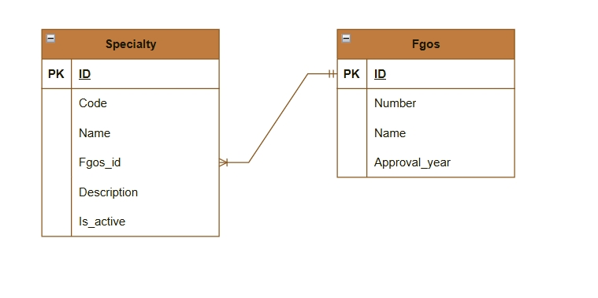

# Вариант №6. Specialty Service — Сервис специальностей

Справочник специальностей (коды, названия, ФГОС).

## Добавить специальность

Информация, требуемая для создания специальности:

| Параметр | Обязательность | Тип | Ограничение | Значение по умолчанию |
|---|---|---|---|---|
| code | Обязательный | str | Уникальный, не пустой, макс. 8 символов | — |
| name | Обязательный | str | Не пустой, макс. 50 символов | — |
| fgos_id | Обязательный | int | Внешний ключ на FGOS | — |
| description | Необязательный | str | Макс. 100 символов | None |

Уникальные комбинации параметров: code — уникален сам по себе.

Информация, возвращаемая в случае удачного создания специальности:

| Параметр | Тип |
|---|---|
| id | int |
| code | str |
| name | str |
| fgos_id | int |
| description | str |
| is_active | bool |

## Изменить специальность по ID

Информация, требуемая для изменения специальности по ID:

| Параметр | Обязательность | Тип | Ограничение | Значение по умолчанию |
|---|---|---|---|---|
| code | Необязательный | str | Уникальный, не пустой, макс. 8 символов | — |
| name | Необязательный | str | Не пустой, макс. 50 символов | — |
| fgos_id | Необязательный | int | Внешний ключ на FGOS | — |
| description | Необязательный | str | Макс. 100 символов | — |

Информация, возвращаемая в случае удачного изменения специальности:

| Параметр | Тип |
|---|---|
| id | int |
| code | str |
| name | str |
| fgos_id | int |
| description | str |
| is_active | bool |

## Удалить специальность по ID

Вернет True, если специальность была удалена, иначе вернет False.

## Получить специальность по ID

Информация, возвращаемая в случае удачного поиска специальности по ID:

| Параметр | Тип |
|---|---|
| id | int |
| code | str |
| name | str |
| fgos_id | int |
| description | str |
| is_active | bool |

## Получить список специальностей по заданным параметрам

Информация, требуемая для получения списка специальностей:

| Параметр | Тип | Описание |
|---|---|---|
| name | str | Фильтр по части названия специальности |
| fgos_id | int | Фильтр по ID стандарта ФГОС |
| code | str | Фильтр по части кода специальности |
| description | str | Фильтр по части описания специальности |
| is_active | bool | Фильтр по активности |

Информация, возвращаемая в виде списка специальностей:

| Параметр | Тип |
|---|---|
| id | int |
| code | str |
| name | str |
| fgos_id | int |
| description | str |
| is_active | bool |

## Добавить ФГОС

Информация, требуемая для создания ФГОС:

| Параметр | Обязательность | Тип | Ограничение | Значение по умолчанию |
|---|---|---|---|---|
| number | Обязательный | str | Уникальный, не пустой, макс. 10 символов | — |
| name | Обязательный | str | Не пустой, макс. 160 символов | — |
| approval_year | Обязательный | int | > 2016 | — |

Уникальные комбинации параметров: number — уникален сам по себе.

Информация, возвращаемая в случае удачного создания ФГОС:

| Параметр | Тип |
|---|---|
| id | int |
| number | str |
| name | str |
| approval_year | int |

## Изменить ФГОС по ID

Информация, требуемая для изменения ФГОС по ID:

| Параметр | Обязательность | Тип | Ограничение | Значение по умолчанию |
|---|---|---|---|---|
| number | Необязательный | str | Уникальный, не пустой, макс. 10 символов | — |
| name | Необязательный | str | Не пустой, макс. 160 символов | — |
| approval_year | Необязательный | int | > 2016 | — |

Информация, возвращаемая в случае удачного изменения ФГОС:

| Параметр | Тип |
|---|---|
| id | int |
| number | str |
| name | str |
| approval_year | int |

## Удалить ФГОС по ID

Вернет True, если ФГОС был удален, иначе вернет False.

## Получить ФГОС по ID

Информация, возвращаемая в случае удачного поиска ФГОС по ID:

| Параметр | Тип |
|---|---|
| id | int |
| number | str |
| name | str |
| approval_year | int |

## Получить список ФГОС по заданным параметрам

Информация, требуемая для получения списка ФГОС:

| Параметр | Тип | Описание |
|---|---|---|
| name | str | Фильтр по части названия ФГОС |
| approval_year | int | Фильтр по году утверждения |

Информация, возвращаемая в виде списка ФГОС:

| Параметр | Тип |
|---|---|
| id | int |
| number | str |
| name | str |
| approval_year | int |

## ER-диаграмма

