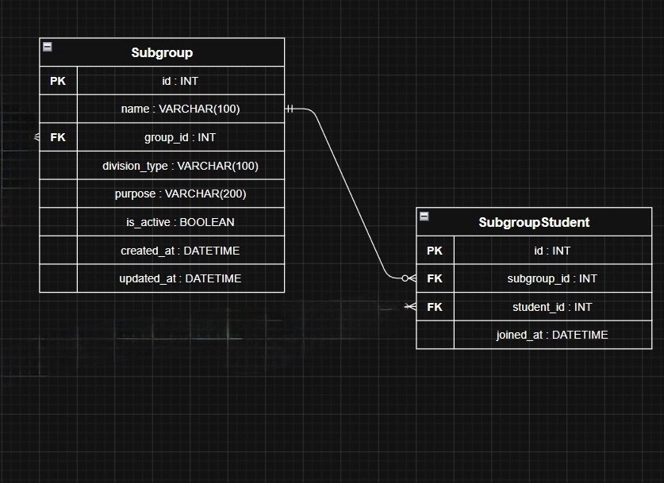

# Вариант 8 — Subgroup Service (Сервис подгрупп)

Сервис управляет подгруппами внутри учебных групп. **Не хранит** сами группы и профили студентов — они управляются Group Service и Profile Service.

---

## Добавить подгруппу

Информация, требуемая для создания подгруппы:

| Параметр      | Пояснение                        | Обязательность | Тип     | Ограничение                      | Значение по умолчанию |
|---------------|----------------------------------|----------------|---------|----------------------------------|-----------------------|
| name          | Название подгруппы               | Да             | string  | 1–100 символов                   | —                     |
| group_id      | ID учебной группы                | Да             | integer | существующий id из Group Service | —                     |
| division_type | Тип деления (язык, физкультура)  | Да             | string  | 1–100 символов                   | —                     |
| purpose       | Описание назначения подгруппы    | Нет            | string  | до 200 символов                  | null                  |

**Уникальные комбинации параметров:**
- `(name, group_id)` — в одной группе не может быть двух подгрупп с одинаковым названием.

Информация, возвращаемая при успешном создании:

| Параметр      | Тип     |
|---------------|---------|
| id            | integer |
| name          | string  |
| group_id      | integer |
| division_type | string  |
| purpose       | string или null |
| is_active     | boolean |
| created_at    | string  |
| updated_at    | string  |

---

## Изменить подгруппу по ID

Информация, требуемая для изменения (все поля необязательны):

| Параметр      | Пояснение                       | Обязательность | Тип     | Ограничение             |
|---------------|---------------------------------|----------------|---------|-------------------------|
| name          | Новое название                  | Нет            | string  | 1–100 символов          |
| group_id      | Новая учебная группа            | Нет            | integer | существующий id         |
| division_type | Новый тип деления               | Нет            | string  | 1–100 символов          |
| purpose       | Новое описание назначения       | Нет            | string  | до 200 символов         |

Информация, возвращаемая при успешном изменении:

| Параметр      | Тип     |
|---------------|---------|
| id            | integer |
| name          | string  |
| group_id      | integer |
| division_type | string  |
| purpose       | string или null |
| is_active     | boolean |
| created_at    | string  |
| updated_at    | string  |

---

## Удалить подгруппу по ID

Вернёт `true`, если подгруппа была деактивирована (`is_active = false`), иначе `false`. Физически запись из БД не удаляется.

---

## Получить подгруппу по ID

| Параметр      | Пояснение                    | Тип     |
|---------------|------------------------------|---------|
| id            | Идентификатор                | integer |
| name          | Название                     | string  |
| group_id      | ID учебной группы            | integer |
| division_type | Тип деления                  | string  |
| purpose       | Описание назначения          | string или null |
| is_active     | Активна ли подгруппа         | boolean |
| created_at    | Дата создания                | string  |
| updated_at    | Дата последнего изменения    | string  |

---

## Получить список подгрупп по заданным параметрам

| Параметр      | Пояснение                    | Тип     | Ограничение |
|---------------|------------------------------|---------|-------------|
| group_id      | Фильтр по учебной группе     | integer |             |
| division_type | Фильтр по типу деления       | string  |             |
| is_active     | Фильтр по активности         | boolean |             |
| limit         | Количество записей           | integer | от 1 до 100 |
| offset        | Смещение                     | integer | ≥ 0         |

Информация возвращается в виде списка подгрупп, каждая содержит:

| Параметр      | Тип     |
|---------------|---------|
| id            | integer |
| name          | string  |
| group_id      | integer |
| division_type | string  |
| purpose       | string или null |
| is_active     | boolean |
| created_at    | string  |
| updated_at    | string  |

---

## Добавить студента в подгруппу

Информация, требуемая для добавления студента:

| Параметр    | Пояснение          | Обязательность | Тип     | Ограничение                              |
|-------------|--------------------|----------------|---------|------------------------------------------|
| subgroup_id | ID подгруппы       | Да             | integer | существующий id                          |
| student_id  | ID студента        | Да             | integer | существующий id из Profile Service       |

**Уникальные комбинации параметров:**
- `(student_id, division_type)` — студент может входить только в одну подгруппу в рамках одного типа деления (проверяется через `division_type` родительской подгруппы).

Информация, возвращаемая при успешном добавлении:

| Параметр    | Тип     |
|-------------|---------|
| id          | integer |
| subgroup_id | integer |
| student_id  | integer |
| joined_at   | string  |

---

## Удалить студента из подгруппы по ID записи

Вернёт `true`, если запись удалена, иначе `false`.

---

## Получить список студентов подгруппы по ID подгруппы

| Параметр    | Пояснение    | Тип     |
|-------------|--------------|---------|
| subgroup_id | ID подгруппы | integer |

Информация возвращается в виде списка:

| Параметр    | Тип     |
|-------------|---------|
| id          | integer |
| subgroup_id | integer |
| student_id  | integer |
| joined_at   | string  |

---

## ER-диаграмма

