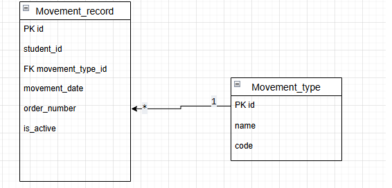

# Вариант 9. Student Movement Service

## Сущность: MovementRecord

### 1. Информация для создания MovementRecord

| Параметр | Пояснение | Обязательность | Тип | Ограничение | Значение по умолчанию |
|-----------|-----------|----------------|-----|-------------|----------------------|
| student_id | ID студента (из Profile Service) | Да | int | >0 | — |
| movement_type_id | ID типа движения | Да | int | существует в MovementType, >0 | — |
| movement_date | дата движения | Да | date | YYYY-MM-DD, не в будущем | — |
| order_number | номер приказа | Да | str | 1-50 символов | — |

### 2. Уникальные комбинации параметров

- (student_id, movement_date, movement_type_id)

### 3. Информация возвращаемая при успешном создании

| Параметр | Тип |
|-----------|-----|
| id | int |
| student_id | int |
| movement_type_id | int |
| movement_date | date |
| order_number | str |
| is_active | bool |

### 4. Информация для изменения MovementRecord по ID

| Параметр | Пояснение | Обязательность | Тип | Ограничение |
|-----------|-----------|----------------|-----|-------------|
| movement_type_id | ID типа движения | Нет | int | >0 |
| movement_date | дата движения | Нет | date | YYYY-MM-DD, не в будущем |
| order_number | номер приказа | Нет | str | 1-50 символов |

### 5. Информация возвращаемая при успешном изменении

| Параметр | Тип |
|-----------|-----|
| id | int |
| student_id | int |
| movement_type_id | int |
| movement_date | date |
| order_number | str |
| is_active | bool |

### 6. Удаление MovementRecord по ID

Мягкое удаление: `is_active = False`.  
Вернет `True`, если запись успешно деактивирована, иначе `False` (если запись не найдена или уже неактивна).

### 7. Получение MovementRecord по ID

| Параметр | Пояснение | Тип |
|-----------|-----------|-----|
| id | ID записи | int |
| student_id | ID студента | int |
| movement_type_id | ID типа движения | int |
| movement_date | дата движения | date |
| order_number | номер приказа | str |
| is_active | активна ли запись | bool |

### 8. Параметры для получения списка MovementRecord

| Параметр | Пояснение | Тип |
|-----------|-----------|-----|
| student_id | ID студента | int |
| movement_type_id | ID типа движения | int |
| movement_date_from | дата движения от | date |
| movement_date_to | дата движения до | date |
| order_number | номер приказа | str |
| limit | лимит записей | int |
| offset | смещение | int |

### 9. Информация возвращаемая при получении списка

| Параметр | Тип |
|-----------|-----|
| id | int |
| student_id | int |
| movement_type_id | int |
| movement_date | date |
| order_number | str |
| is_active | bool |

## Список функций

1. `init_db()` — создание таблиц и заполнение справочника типов движений
2. `create_movement()` — создание записи о движении
3. `get_movement_by_id()` — получение записи по ID
4. `update_movement()` — обновление записи
5. `delete_movement()` — мягкое удаление записи
6. `get_movements_by_student()` — получение списка движений по ID студента
7. `get_movements_by_type()` — получение списка движений по типу

## ER-диаграмма

